# Lab 1: Load Data into Azure Synapse Analytics using Azure Data Factory Pipelines
In this lab you will configure the Azure environment to allow relational data to be transferred from an Azure SQL Database to an Azure Synapse Analytics data warehouse using Pipelines from Azure Synapse. The dataset you will use contains data about motor vehicle collisions that happened in New Your City from 2012 to 2019. You will use Power BI to visualise collision data loaded from your Azure Synapse Analytics data warehouse.

The estimated time to complete this lab is: **30 minutes**.

## Microsoft Learn & Technical Documentation

The following Azure services will be used in this lab. If you need further training resources or access to technical documentation please find in the table below links to Microsoft Learn and to each service's Technical Documentation.

Azure Service | Microsoft Learn | Technical Documentation|
--------------|-----------------|------------------------|
Azure SQL Database | [Work with relational data in Azure](https://docs.microsoft.com/en-us/learn/paths/work-with-relational-data-in-azure/) | [Azure SQL Database Technical Documentation](https://docs.microsoft.com/en-us/azure/sql-database/)
Azure Synapse Analytics - Pipelines | [Data ingestion with Azure Data Factory](https://docs.microsoft.com/en-us/azure/synapse-analytics/quickstart-copy-activity-load-sql-pool)| [Azure Data Factory Technical Documentation](https://docs.microsoft.com/en-us/azure/synapse-analytics/get-started-pipelines)
Azure Synapse Analytics | [Implement a Data Warehouse with Azure Synapse Analytics](https://docs.microsoft.com/en-us/learn/paths/implement-sql-data-warehouse/) | [Azure Synapse Analytics Technical Documentation](https://docs.microsoft.com/en-us/azure/sql-data-warehouse/)
Azure Data Lake Storage Gen2 | [Large Scale Data Processing with Azure Data Lake Storage Gen2](https://docs.microsoft.com/en-us/learn/paths/data-processing-with-azure-adls/) | [Azure Data Lake Storage Gen2 Technical Documentation](https://docs.microsoft.com/en-us/azure/storage/blobs/data-lake-storage-introduction)

## Lab Architecture
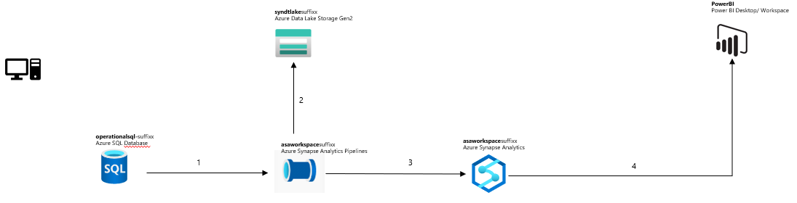

Step     | Description
-------- | -----
 | Build an Azure Synapse Pipeline to copy data from an Azure SQL Database table
 | Use Azure Storage as a staging area for Polybase
 | Load data to an Azure Synapse Analytics table using Polybase
 | Visualize data from Azure Synapse Analytics using Power BI

**IMPORTANT**: Some of the Azure services provisioned require globally unique name and a “-suffix” has been added to their names to ensure this uniqueness. Please take note of the suffix generated as you will need it for the following resources in this lab:

Name	                     |Type
-----------------------------|--------------------
syndtlake*suffix*	         |Data Lake Storage Gen2
asaworkspace*suffix*     | Azure Synapse Analytics workspace
operationalsql-*suffix* |SQL server
asastore*suffix*               | Azure storage account


## Create Azure Synapse Analytics data warehouse objects
In this section you will connect to Azure Synapse Analytics to create the database objects used to host and process data.


1.	Access your Azure Synapse Analytics workspace resource and click on "Open Synapse Studio":

    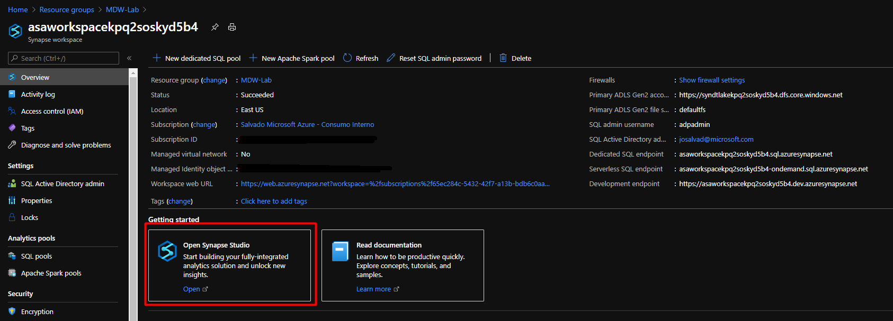

2.	On the Azure Synapse studio select the **Data *(Databse icon)*** option:

    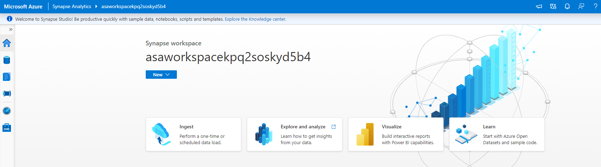

3.	Expand the the Databases, observe that we have already a Dedicated SQL Pool created (SynapseDW), this pool was created when we deployed the resources. Click on the **...** and then selecte "Empty script":

    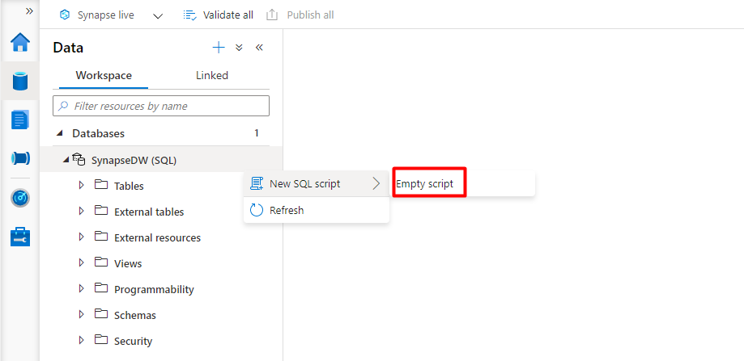

4.	Copy and paste the code bellow, the code will create a new database schema named [NYC].
Make sure that you are connected to SynapseDW and that you are using the SynapseDW database:

    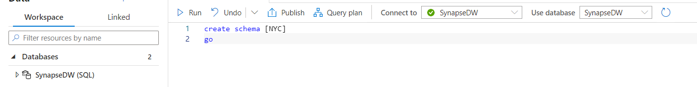


```sql
create schema [NYC]
go
```


5.	Create a new round robin distributed table named NYC.NYPD_MotorVehicleCollisions, see column definitions on the SQL Command:

```sql
create table [NYC].[NYPD_MotorVehicleCollisions](
	[UniqueKey] [int] NULL,
	[CollisionDate] [date] NULL,
	[CollisionDayOfWeek] [varchar](9) NULL,
	[CollisionTime] [time](7) NULL,
	[CollisionTimeAMPM] [varchar](2) NOT NULL,
	[CollisionTimeBin] [varchar](11) NULL,
	[Borough] [varchar](200) NULL,
	[ZipCode] [varchar](20) NULL,
	[Latitude] [float] NULL,
	[Longitude] [float] NULL,
	[Location] [varchar](200) NULL,
	[OnStreetName] [varchar](200) NULL,
	[CrossStreetName] [varchar](200) NULL,
	[OffStreetName] [varchar](200) NULL,
	[NumberPersonsInjured] [int] NULL,
	[NumberPersonsKilled] [int] NULL,
	[IsFatalCollision] [int] NOT NULL,
	[NumberPedestriansInjured] [int] NULL,
	[NumberPedestriansKilled] [int] NULL,
	[NumberCyclistInjured] [int] NULL,
	[NumberCyclistKilled] [int] NULL,
	[NumberMotoristInjured] [int] NULL,
	[NumberMotoristKilled] [int] NULL,
	[ContributingFactorVehicle1] [varchar](200) NULL,
	[ContributingFactorVehicle2] [varchar](200) NULL,
	[ContributingFactorVehicle3] [varchar](200) NULL,
	[ContributingFactorVehicle4] [varchar](200) NULL,
	[ContributingFactorVehicle5] [varchar](200) NULL,
	[VehicleTypeCode1] [varchar](200) NULL,
	[VehicleTypeCode2] [varchar](200) NULL,
	[VehicleTypeCode3] [varchar](200) NULL,
	[VehicleTypeCode4] [varchar](200) NULL,
	[VehicleTypeCode5] [varchar](200) NULL
) 
with (distribution = round_robin)
go
```

## Create a new Pipeline to Copy Relational Data
In this section you will build a pipeline in Azure Synapse to copy a table from NYCDataSets database to Azure Synapse Analytics data warehouse.


### Create Linked Service connections


1.	In the **Azure Synapse Studio** click the **Manage *(toolcase icon)*** option on the left-hand side panel. Under **Linked services** menu item, click **+ New** to create a new linked service connection. 

    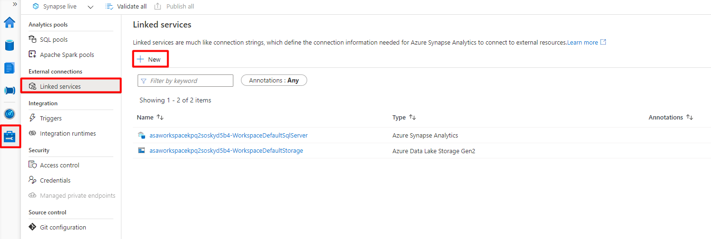

2.	On the **New Linked Service** blade, type “Azure SQL Database” in the search box to find the **Azure SQL Database** linked service. Click **Continue**.

    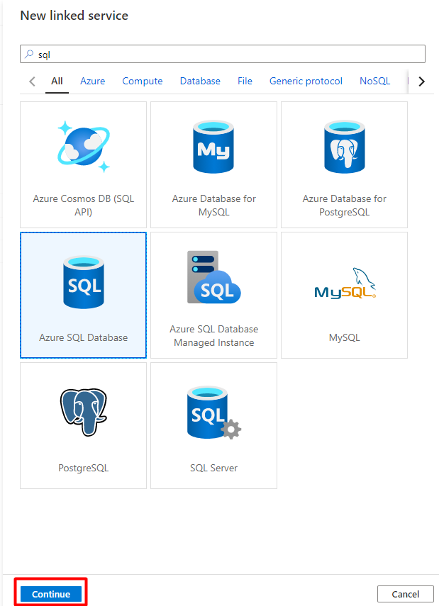

3.	On the **New Linked Service (Azure SQL Database)** blade, enter the following details:
    <br>- **Name**: OperationalSQL_NYCDataSets
    <br>- **Account selection method**: From Azure subscription
    <br>- **Azure subscription**: *[your subscription]*
    <br>- **Server Name**: operationalsql-*suffix*
    <br>- **Database Name**: NYCDataSets
    <br>- **Authentication** Type: SQL Authentication 
    <br>- **User** Name: ADPAdmin
    <br>- **Password**: P@ssw0rd123!

4.	Click **Test connection** to make sure you entered the correct connection details and then click **Create**.

    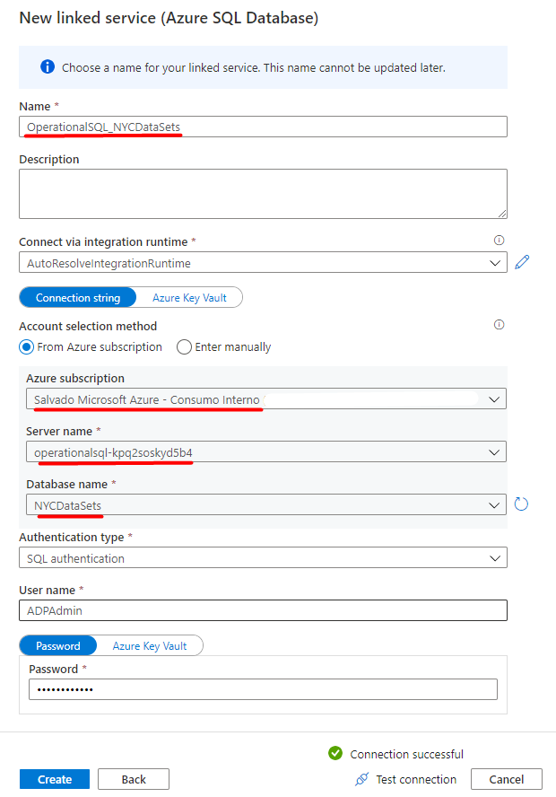

5.	Repeat the process to create an **Azure Synapse Analytics** linked service connection.

    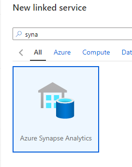

6.	On the New Linked Service (Azure Synapse Analytics) blade, enter the following details:
    <br>- **Name**: SynapseSQL_SynapseDW
    <br>- **Connect via integration runtime**: AutoResolveIntegrationRuntime
    <br>- **Account selection method**: From Azure subscription
    <br>- **Azure subscription**: *[your subscription]*
    <br>- **Server Name**: asaworkspace*suffix*
    <br>- **Database Name**: SynapseDW
    <br>- **Authentication** Type: SQL Authentication 
    <br>- **User** Name: ADPAdmin
    <br>- **Password**: P@ssw0rd123!
7.	Click **Test connection** to make sure you entered the correct connection details and then click **Create**.

    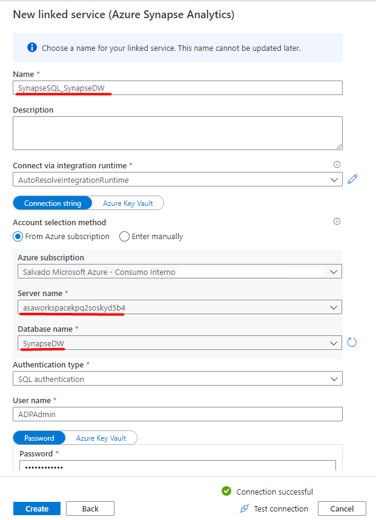

8.	Repeat the process once again to create an **Azure Blob Storage** linked service connection.

    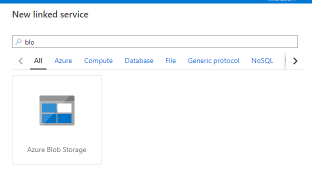

9.	On the **New Linked Service (Azure Blob Storage)** blade, enter the following details:
    <br>- **Name**: SynapseDataLake
    <br>- **Connect via integration runtime**: AutoResolveIntegrationRuntime
    <br>- **Authentication method**: Account key
    <br>- **Account selection method**: From Azure subscription
    <br>- **Azure subscription**: *[your subscription]*
    <br>- **Storage account name**: syndtlake*suffix*

10.	Click **Test connection** to make sure you entered the correct connection details and then click **Create**.

    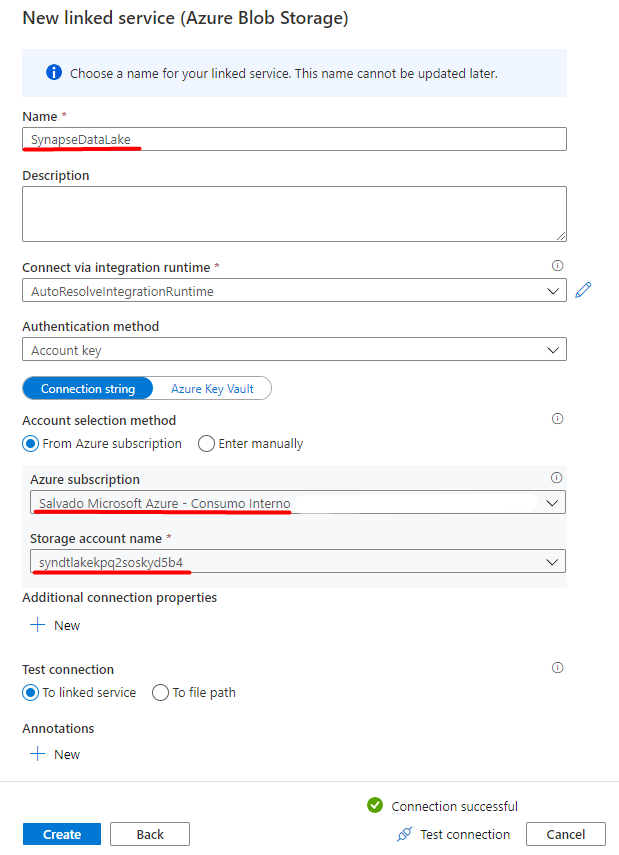

11.	Repeat the process once again to create an **Azure Blob Storage** linked service connection.

    

12.	On the **New Linked Service (Azure Blob Storage)** blade, enter the following details:
    <br>- **Name**: PolyBaseStorage
    <br>- **Connect via integration runtime**: AutoResolveIntegrationRuntime
    <br>- **Authentication method**: Account key
    <br>- **Account selection method**: From Azure subscription
    <br>- **Azure subscription**: *[your subscription]*
    <br>- **Storage account name**: asastore*suffix*

13.	Click **Test connection** to make sure you entered the correct connection details and then click **Create**.

    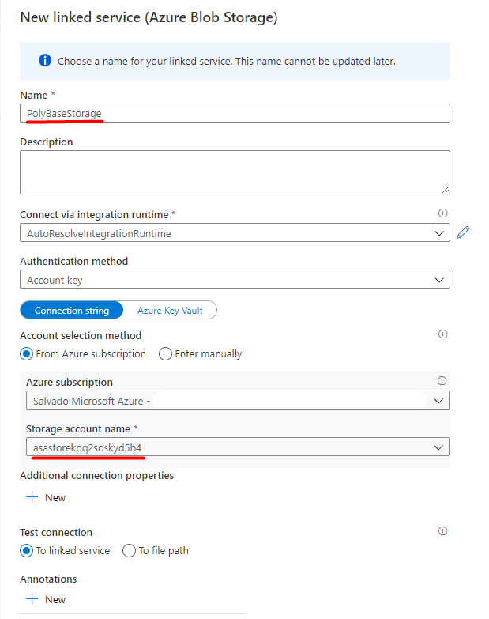


11.	You should now see this 4 linked services connections that will be used for the copy activity. We will be using the PolyBaseStorage linked service so that we have a storage account only dedicated for staging copy processes. 

    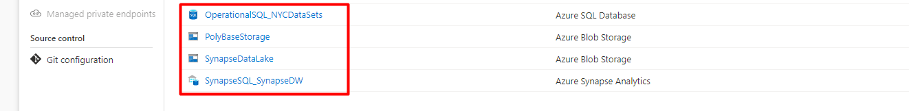

### Create Source and Destination Data Sets


1.	In the **Azure Synapse Analytics** portal and click the **Data *(Databse icon)*** option on the left-hand side panel. Click on the "+" and then select **Integration dataset** to create a new dataset.

    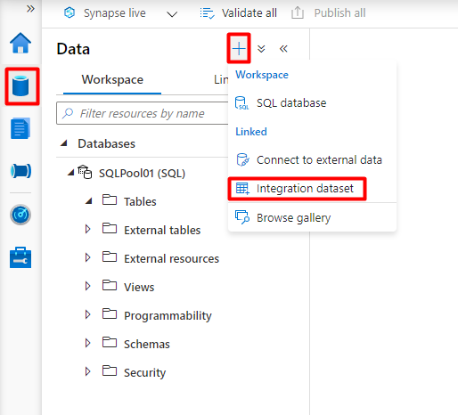

2.	Type "Azure SQL Database" in the search box and select **Azure SQL Database**. Click **Finish**.

    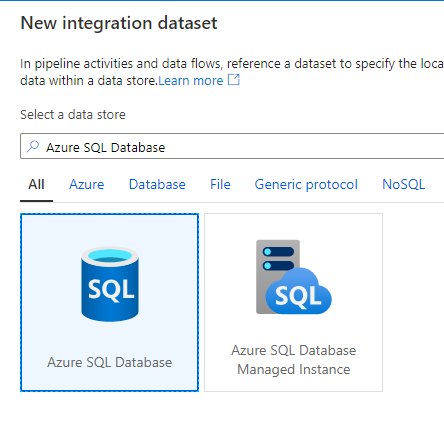

3.	On the **New Data Set** tab, enter the following details:
    <br>- **Name**: NYCDataSets_MotorVehicleCollisions
    <br>- **Linked Service**: OperationalSQL_NYCDataSets
    <br>- **Table**: [NYC].[NYPD_MotorVehicleCollisions]

    Alternatively you can copy and paste the dataset JSON definition below:

    ```json
    {
        "name": "NYCDataSets_MotorVehicleCollisions",
        "properties": {
            "linkedServiceName": {
                "referenceName": "OperationalSQL_NYCDataSets",
                "type": "LinkedServiceReference"
            },
            "folder": {
                "name": "Lab1"
            },
            "annotations": [],
            "type": "AzureSqlTable",
            "schema": [],
            "typeProperties": {
                "schema": "NYC",
                "table": "NYPD_MotorVehicleCollisions"
            }
        }
    }
    ```

4.	Leave remaining fields with default values and click **OK**.

    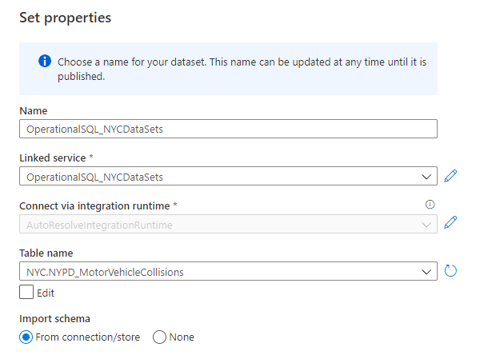

5.	Repeat the process to create a new **Azure Synapse Analytics** data set.

    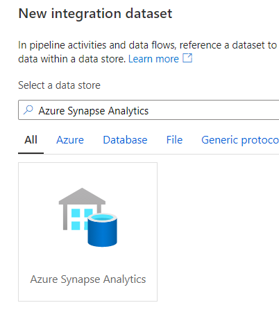

6.	On the **New Data Set** tab, enter the following details:
    <br>- **Name**: SynapseDW_MotorVehicleCollisions
    <br>- **Linked Service**: SynapseSQL_SynapseDW
    <br>- **Table**: [NYC].[NYPD_MotorVehicleCollisions]

    Alternatively you can copy and paste the dataset JSON definition below:

    ```json
    {
        "name": "SynapseDW_MotorVehicleCollisions",
        "properties": {
            "linkedServiceName": {
                "referenceName": "SynapseSQL_SynapseDW",
                "type": "LinkedServiceReference"
            },
            "folder": {
                "name": "Lab1"
            },
            "annotations": [],
            "type": "AzureSqlDWTable",
            "schema": [],
            "typeProperties": {
                "schema": "NYC",
                "table": "NYPD_MotorVehicleCollisions"
            }
        }
    }
    ```

7.	Leave remaining fields with default values and click **OK**.

    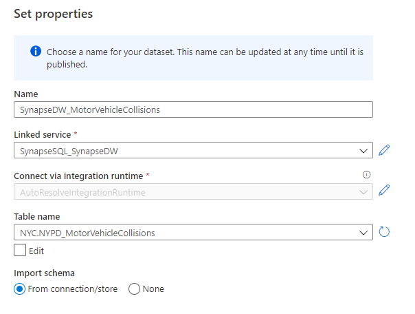

8. Under **Linked** tab, click the ellipsis **(…)** next to **Integration datasets** and then click **New folder** to create a new Folder. Name it **Lab1**.

    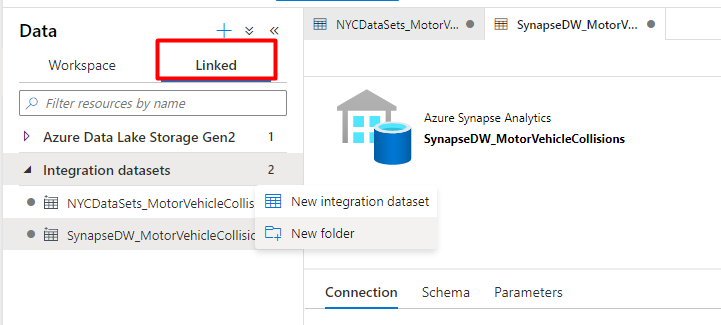

9. Drag the two datasets created into the **Lab1** folder you just created.

    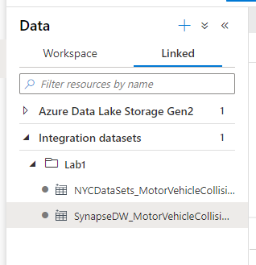

10.	Publish your dataset changes by clicking the **Publish All** button on the top of the screen.

    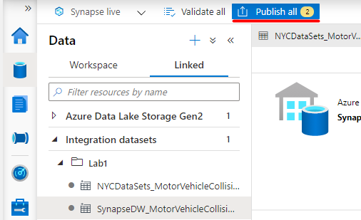

### Create and Execute Pipeline


1.	In the **Azure Synapse workspace studio** portal click in the **Integrate** blade on the left-hand side panel. On the top click **+** and then click **Pipeline** to create a new pipeline.
    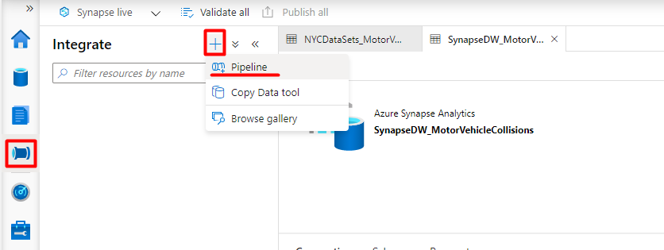


2.	On the rigth under **Properties**, enter the following details:
    <br>- **General > Name**: Lab1 - Copy Collision Data
3.	Leave remaining fields with default values.

    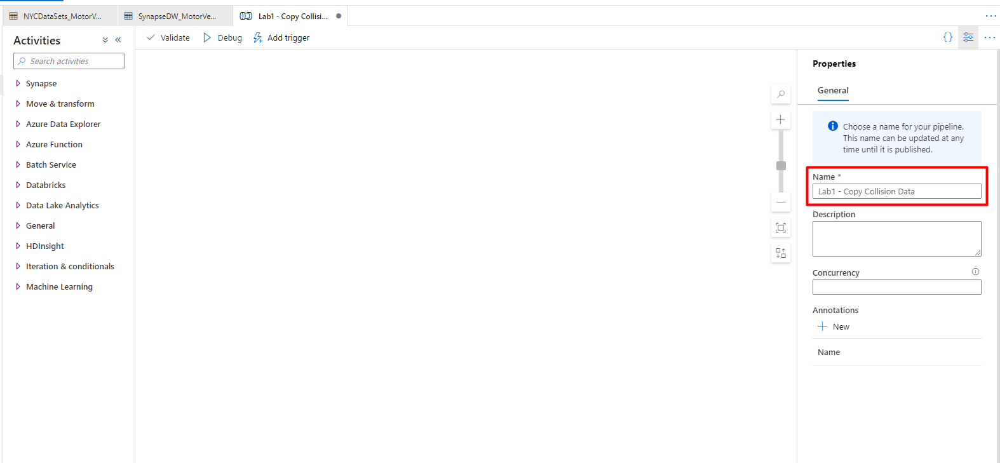

4.	From the **Activities** panel, type “Copy Data” in the search box. Drag the **Copy Data** activity on to the design surface.

    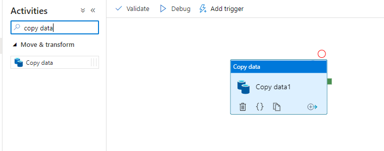

5.	Select the **Copy Data** activity and enter the following details:
    <br>- **General > Name**: CopyMotorVehicleCollisions
    <br>- **Source > Source dataset**: NYCDataSets_MotorVehicleCollisions
    <br>- **Sink > Sink dataset**: SynapseDW_MotorVehicleCollisions
    <br>- **Sink > Allow PolyBase**: Checked
    <br>- **Settings > Enable staging**: Checked
    <br>- **Settings > Staging account linked service**: PolyBaseStorage
    <br>- **Settings > Storage Path**: polybase
6.	Leave remaining fields with default values.

    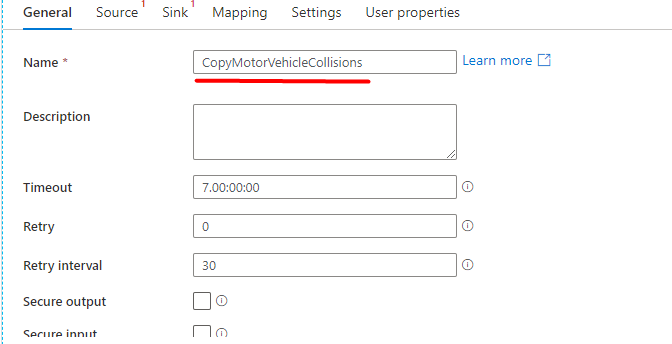
    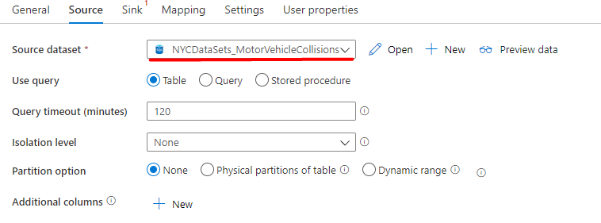
    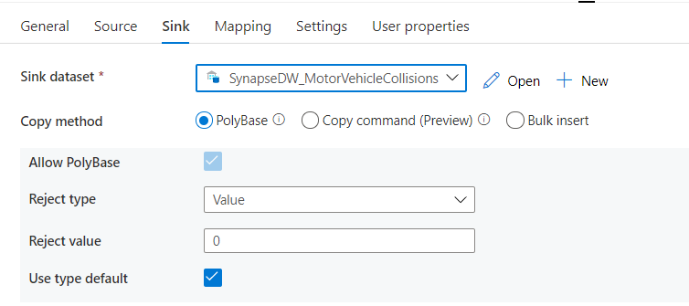
    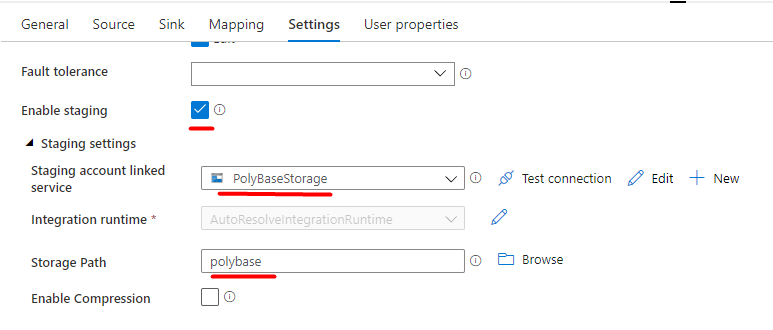

7.	Publish your pipeline changes by clicking the **Publish all** button.

    

8.	To execute the pipeline, click on **Add trigger** menu and then **Trigger Now**.
9.	On the **Pipeline Run** blade, click **OK**.

    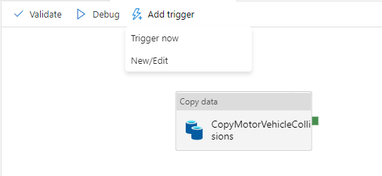

10.	To monitor the execution of your pipeline, click on the **Monitor** icon on the left-hand side panel.
11.	You should be able to see the Status of your pipeline execution on the right-hand side panel.

    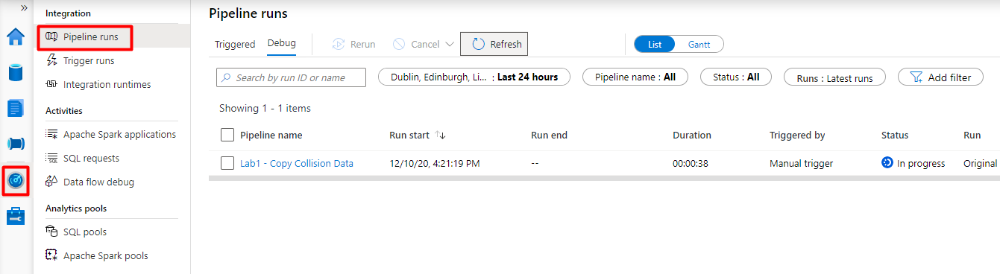

## Visualize Data with Power BI
In this section you are going to use Power BI to visualize data from Azure Synapse Analytics. The Power BI report will use an Import connection to query Azure Synapse Analytics and visualise Motor Vehicle Collision data from the table you loaded in the previous exercise.


1.	On your desktop, download the Power BI report from the link https://aka.ms/ADPLab1 and save it on the Desktop.
2.	Open the file ADPLab1.pbit with Power BI Desktop. Optionally sign up for the Power BI tips and tricks email, or to dismiss this, click to sign in with an existing account, and then hit the escape key.
3.	When prompted to enter the value of the **SynapseSQLEnpoint** parameter, type the full server name: asaworkspace*suffix*.sql.azuresynapse.net

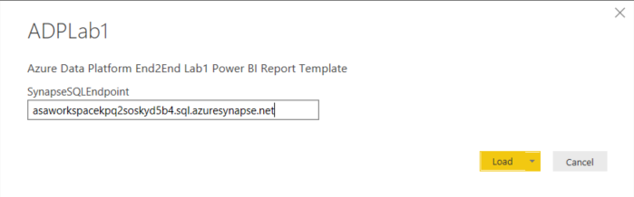

4.	Click Load, and then Run to acknowledge the Native Database Query message
5.	When prompted, enter the **Database** credentials:
    <br>- **User Name**: adpadmin
    <br>- **Password**: P@ssw0rd123!

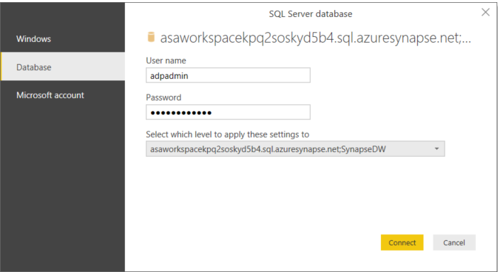

6.	Once the data is finished loading, interact with the report by changing the CollisionDate slicer and by clicking on the other visualisations.

7.	Save your work and close Power BI Desktop.

    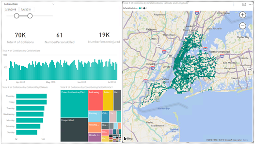


## Visualize Data with Power BI in Synapse (Optional)

In this section you will publish your report to Power BI Pro account and then link it with Azure Synapse and see it in the Azure Synapse.


1. Go to Power BI portal at https://msit.powerbi.com/ and sign in with the account associated to your Power BI Pro account and create a new workspace with name "LabHandsON" by clicking on **Create a workspace**, enter the name in Workspace name and save it.

    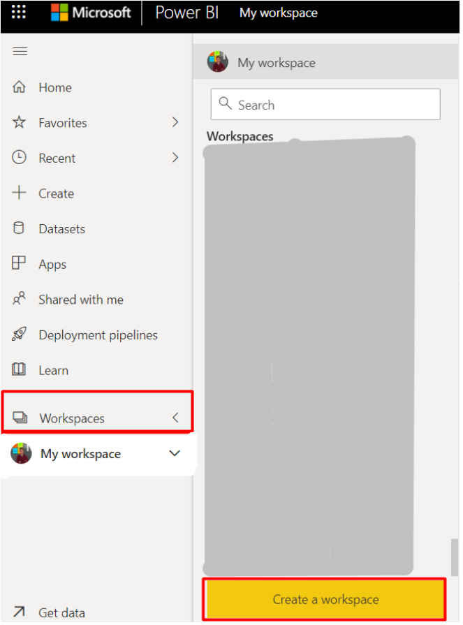


2. On the Power BI Desktop click on the **Publish** button.

    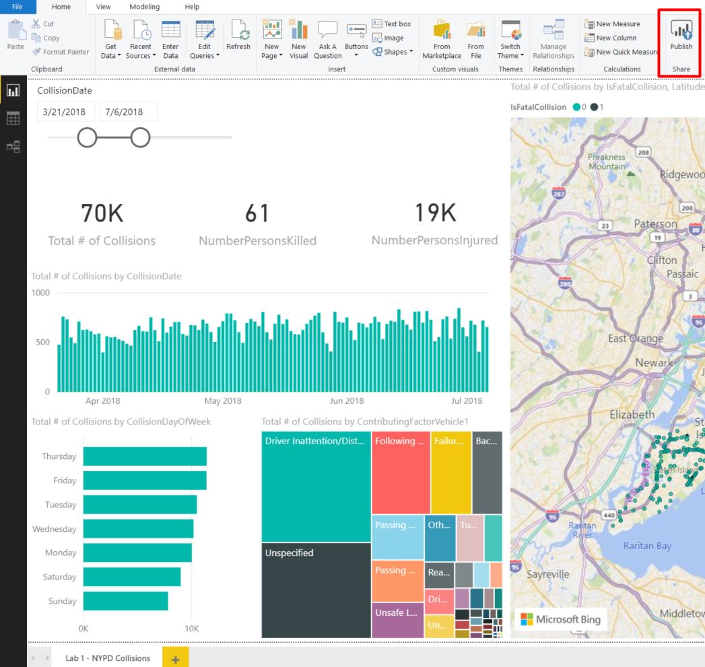

3. Sign in your account associated with the Power BI Pro account, select the workspace "LabHandsON" and then the publish will start. After finishing you will have report available in the Power BI portal.

    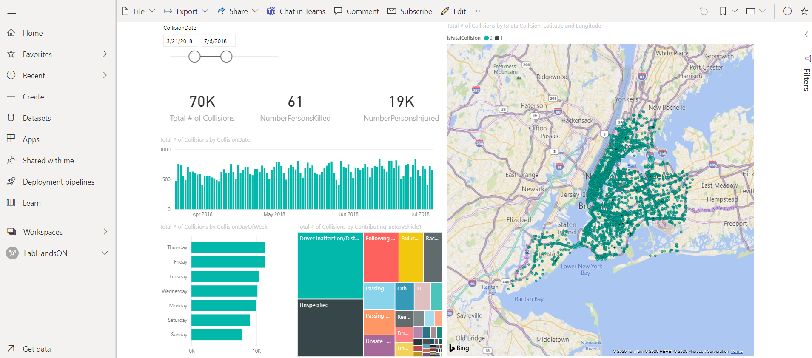

4. Go back to the Azure Synapse Studio click in the **Manage *(toolcase icon)*** option on the left-hand side panel. Under **Linked services** menu item, click **+ New** to create a new linked service connection to Power BI.

5. On the **New Linked Service** blade, type “Power BI” in the search box to find the **Power BI** linked service. Click **Continue**.

    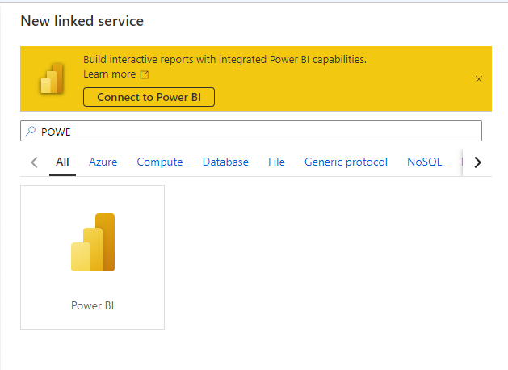

6. On the New Linked Service (Power BI) blade, enter the following details:
    <br>- **Name**: PowerBIWorkspaceLink
    <br>- **Tenant**: your PBI Pro account Tenant
    <br>- **Workspace name**: LabHandsON

    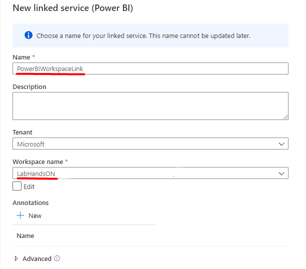

7. In the **Azure Synapse Analytics** portal click in the **Develop *(pages icon)*** option on the left-hand side panel. Drill down the Power BI reports and confirm that we have already our report here.

    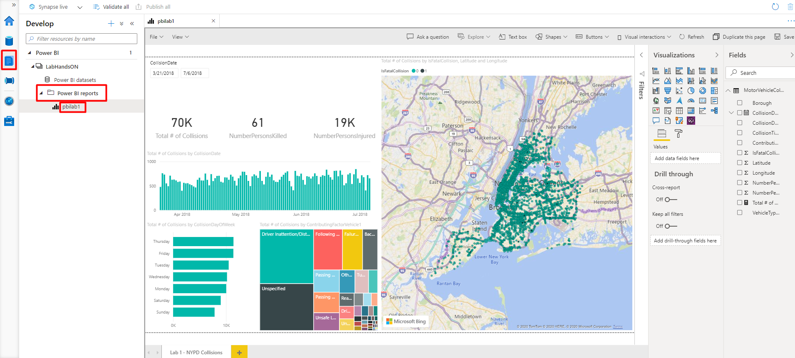
