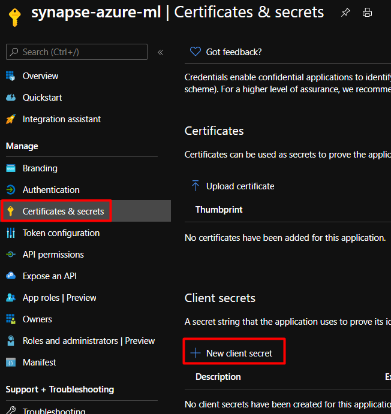
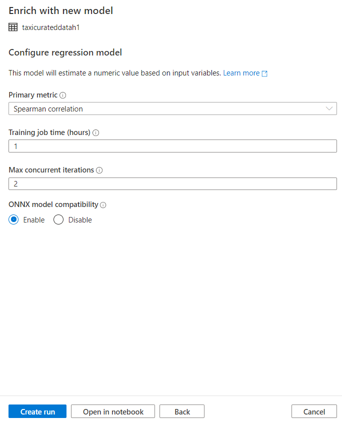
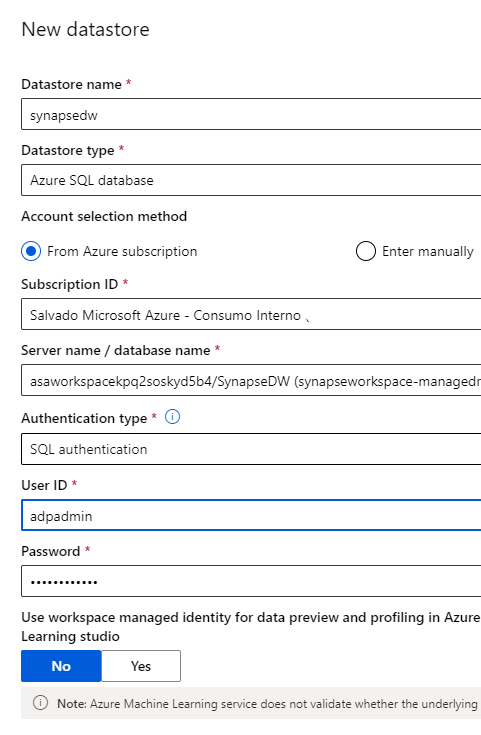
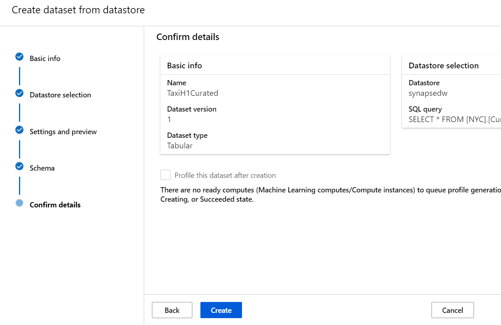
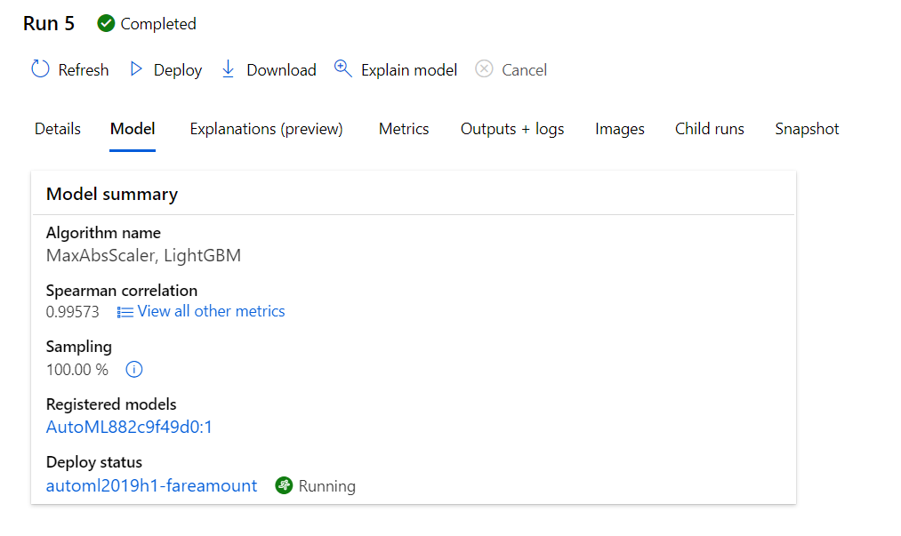

# Lab 6: Create and deploy a Machine Learning Model using Auto ML
In this lab you will use Azure Machine Learning and Azure Synapse Analytics to create a model to predict tha taxi fare prices from the NYC Taxa Data. You will use Auto ML which is a feature that automatically trains a set of machine learning models and allows you to select the best model based on specific metrics. 


The estimated time to complete this lab is: **30 minutes**.

## Microsoft Learn & Technical Documentation

The following Azure services will be used in this lab. If you need further training resources or access to technical documentation please find in the table below links to Microsoft Learn and to each service's Technical Documentation.

Azure Service | Microsoft Learn | Technical Documentation|
--------------|-----------------|------------------------|
Azure Machine Learning | [Train machine learning models Azure Machine Learning - Azure Synapse](https://docs.microsoft.com/en-us/azure/synapse-analytics/spark/apache-spark-machine-learning-training) | [Azure Machine Learning](https://docs.microsoft.com/en-us/azure/machine-learning/overview-what-is-azure-ml)
Azure Synapse Analytics | [Implement a Data Warehouse with Azure Synapse Analytics](https://docs.microsoft.com/en-us/learn/paths/implement-sql-data-warehouse/) | [Azure Synapse Analytics Technical Documentation](https://docs.microsoft.com/en-us/azure/sql-data-warehouse/)

## Lab Architecture


Step     | Description
-------- | -----
 | Configure a Linked Service to Azure Machine Learning in Synapse
 | Create an Auto ML Experiment in Azure Synapse
 | Create an Auto ML Experiment in Azure Machine Learning
 | Review the results in the Azure Machine Learning Studio

**IMPORTANT**: Some of the Azure services provisioned require globally unique name and a “-suffix” has been added to their names to ensure this uniqueness. Please take note of the suffix generated as you will need it for the following resources in this lab:

Name	                     |Type
-----------------------------|--------------------
amlworkspace*suffix*	         | Azure Machine Learning
asaworkspace*suffix*         | Azure Synapse Analytics workspace


## Create a Linked Service connection to Azure Machine Learning and Service Principal for connection

Now we will create a Linked Service connection between Azure Synapse Analytics workspace and Azure Machine Learning workspace. Linking these workspaces allows you to leverage Azure Machine Learning from various experiences in Synapse.

For example, this linking to an Azure Machine Learning workspace enables these experiences:

- Run your Azure Machine Learning pipelines as a step in your Synapse pipelines. 

- Enrich your data with predictions by bringing a machine learning model from the Azure Machine Learning model registry and score the model in Synapse SQL pools. 


### Create a service principal

This step will create a new Service Principal. 
1. Open Azure portal. 

2. Go to **Azure Active Directory** -> **App registrations**.

3. Click **New registration**. Then, follow instructions on the UI to register a new application. For the name choose "synapse-azure-ml" for example and hen click **Register**

    

    

4. After the application is registered. Generate a secret for the application. Go to **Your application** -> **Certificate & Secret**. Click **Add client secret** to generate a secret. Keep the secret safe and it will be used later. For the name choose "amlsecret" and click **Add**.

    

    

5. Create a service principal for the application. Go to **Your application** -> **Overview** and then click **Create service principal**. In some cases, this service principal is automatically created like bellow.

    

6. Navigate in Azure portal to your amlworkspace*suffix* resource and add the service principal created as "contributor" of the Azure Machine Learning workspace. Search for the resource amlworkspace*suffix* and then on **Access control (IAM)** add the contributor role to the synapse-azure-ml, click on the **Save** button.

    
    


### Create a linked service


1.	In Azure Synapse studio click in the **Manage option *(toolcase icon)*** on the left-hand side panel. Under **Linked services** menu item, click **+ New** to create a new linked service connection.

    

2.	On the **New Linked Service** blade, type Azure Machine Learning in the search box to find the **Azure Machine Learning** linked service. Click **Continue**.

    

3.	On the **New Linked Service (Azure Machine Learning)** blade, enter the following details:
    <br>- **Name**: AzureMLSynapse
    <br>- **Connect via integration runtime**: AutoResolveIntegrationRuntime
    <br>- **Azure Machine Learning workspace selection method**: From Azure subscription
    <br>- **Azure subscription**: *[your subscription]*
    <br>- **Azure Machine Learning workspace name**: amlworkspace*suffix*
    <br>- **Service principal ID**: **application (client) ID** of the Application
    <br>- **Service principal key**: The secret you generated in the previous section for amlsecret.

    > [!NOTE]
    > application (client) ID is NOT the name of the application. You can find this ID in the overview page of the application. It should be a long string looking similar to this "81707eac-ab38-406u-8f6c-10ce76a568d5".


4.	Click **Test connection** to make sure you entered the correct connection details and then click **Create**.

    


## Implement the Auto ML Experiment in Azure Synapse

In this section you will use the curated data that was processed before in LAB3 to create a Spark Data Frame in Azure Synapse, we will also copy those table to our SQL dedicated pool so that they can be consumed later. Finally you will learn how you can create a new Auto ML experiment from Azure Synapse using the Spark Data Frame that you created.


1. Connect to your Azure Synapse studio and select the **Data *(Databse icon)*** option and then select the **Linked** tab.

2. Expand **Azure Data Lake Storage Gen2**. Expand the DataLakeQueryConnection account and select nyctaxidata-curated, click on the one **PickUpYearMonth=2019-01** and then right click in the first parquet file, finally click **New notebook** and select **New Spark Table**.

    


3. We will use a sampling of half of the data to train our model and a sample of half of the data for testing, so overwrite the code with the code bellow. Notice how we are reading all the .parquet files. We will sample a small subset of the first half and second half of the year for simplicity. . Remember to change the syndtlake*suffix*.


```python

%%pyspark

base_path ='abfss://nyctaxidata-curated@syndtlakekpq2soskyd5b4.dfs.core.windows.net/PickUpYearMonth='


filesh1 = [base_path + '2019-01/*.parquet', 
        base_path + '2019-02/*.parquet',         
        base_path + '2019-03/*.parquet',
        base_path + '2019-04/*.parquet',
        base_path + '2019-05/*.parquet',
        base_path + '2019-06/*.parquet',
        ]

filesh2 = [base_path + '2019-07/*.parquet', 
        base_path + '2019-08/*.parquet',         
        base_path + '2019-09/*.parquet',
        base_path + '2019-10/*.parquet',
        base_path + '2019-11/*.parquet',
        base_path + '2019-12/*.parquet',
        ]


dfh1 = spark.read.load(filesh1, format='parquet')
dfh2 = spark.read.load(filesh2, format='parquet')
noOfSamples=10000


#Get a sample from df1, df2 is small so no need for sampling
dfh1 = dfh1.sample(noOfSamples / dfh1.count())

```

4. Now, you are going to save those dataframes, copy the code bellow to the next cell.


```python

%%pyspark

dfh1.write.mode("overwrite").saveAsTable("default.TaxiCuratedDataH1")
dfh2.write.mode("overwrite").saveAsTable("default.TaxiCuratedDataH2")

```

5. Finally, copy the data on the Dataframe to our SQL Dedicated Pool. Copy the code bellow to the next cell, we are going to use Scala for this task. Observe how easy it is to ingest data from the Spark pools to our SQL Pools and how it creates the tables for us.

```python

%%spark
val scala_dfh1 = spark.sqlContext.sql ("select * from default.taxicurateddatah1")
scala_dfh1.write.synapsesql("synapsedw.nyc.CuratedTaxi2019H1", Constants.INTERNAL)

val scala_dfh2 = spark.sqlContext.sql ("select * from default.taxicurateddatah2")
scala_dfh2.write.synapsesql("synapsedw.nyc.CuratedTaxi2019H2", Constants.INTERNAL)


```

6. In the properties change the name of the Notebook to "Lab6 - Spark create tables" and Publish all.

    


7. Select **Run all** on the notebook toolbar to execute the notebook, observe the results bellow and notice the table created under the **default (Spark)** and under **SynapseDW**.

    

8.	Click on the **default (Spark)** and expand the tables. On the **taxicurateddatah1** Click on the **...** and then select **Machine Learning** and finally **Enrich with new model**. 

    

. This will pop a wizzard to help you train a machine learning model using Auto ML. In this experiment we will create a regression model to predict the FareAmount. Enter the details bellow and then click **Continue**.

<br>- **Azure Machine Learning workspace**: amlworkspace*suffix*
<br>- **Experiment name**: AzureAutoML-TaxiH1-FareAmount
<br>- **Best model name**: AzureAutoML-TaxiH1-FareAmount-BestModel
<br>- **Target column**: FareAmount (decimal(8,2))
<br>- **Spark pool**: SparkPool01


7. For the model type we want to estimate a numeric value (the fare amount for the trip) using the input variables so select the Regression model and then click **Continue**.

    

8. Now change the training hours for 1, and enable the ONNX model compatibility. If you want to explore what is happening behind the scenes and customize some parameters then click on **Open in notebook**, otherwise just click on **Create Run**, this will start the Auto ML machine learning experiment. If you click on Open in notebook you will need to repeat the steps again to create a new AutoML experiment.


    
    


## Implement the Auto ML Experiment in Azure Machine Learning Service

In this section you will use Azure Machine Learning and create a DataStore and a Dataset for the Auto ML experiment to predict the FarePrice. The table from CuratedTaxi2019H1 containing curated taxi data will be used for training a simple auto ML, while the table CuratedTaxi2019H2 will be used for testing proposes. 


### SQL Datastore and source Dataset for Azure AutoML

1. Open the lab resource group, locate and open the **amlworkspace*suffix*** Machine Learning resource. Click on **Launch studio**.

    

2. From the left menu of **Azure Machine Learning Studio**, select the **Datastores** item.

    

3. Select **New datastore** to create a new datastore.

    

4.  On the **New datastore** blade, configure it as follows and select **Create**:

    | Field | Value |
    |--------------|---------------|
    | New datastore (name) | synapsedw |
    | Datastore type | Azure SQL database |
    | Account selection method | From Azure subscription |
    | Subscription ID | Select the lab subscription. |
    | Server name / database name  | Select asaworkspace{{suffix}}/SynapseDW. |
    | Authentication type | SQL authentication |
    | User ID | adpadmin |
    | Password | P@ssw0rd123! |

    

5. From the left menu, select **Datasets**, and with the **Registered datasets** tab selected, expand the **+ Create dataset** button and select **From datastore**.

    

6. In the **Create dataset from datastore** Basic info form, name the dataset **TaxiH1Curated** and select **Next**.

    

7. On the **Datastore selection** form, select **Previously created datasource**, choose **synapsedw** from the list and select the **Select datasource** button.

    


8. In the next **Datastore selection** form, enter the following **SQL query**. Select **Next**:

    ```sql
    SELECT  *
    FROM [NYC].[CuratedTaxi2019H1]
    ```


9. The **Settings and preview** data table will be displayed after a few moments. Review this data, then select the **Next** button.

    


10. Review the **Schema** field listing, then select **Next**.

    

11. On the **Confirm details** screen, select **Create**.

    

### Create compute infrastructure

1. From the left menu of Machine Learning Studio, select **Compute**.

2. On the **Compute** screen with the **Compute instances** tab selected. Choose the **Create** button.

    

3. On the **Create compute instance**, **Select virtual machine** form, configure it as follows, then select **Next**:

    | Field | Value |
    |--------------|---------------|
    | Virtual machine type | CPU |
    | Virtual machine size | Search for and select Standard_DS3_v2. |

    

4. On the **Configure Settings** form, enter a globally unique **Compute name** of your choice, and select **Create**.

    

5. Select the **Compute clusters** tab, and select **Create**.

6. On the **New compute cluster**, **Select virtual machine** form, configure the virtual machine as follows, then select **Next**:

    | Field | Value |
    |--------------|---------------|
    | Virtual machine priority | Dedicated |
    | Virtual machine type | CPU |
    | Virtual machine size | Search for and select Standard_DS3_v2. |

    

7. On the **Configure Settings** form, configure it as follows, then select **Create**:

    | Field | Value |
    |--------------|---------------|
    | Compute name | autoazmlcluster |
    | Minimum number of nodes | 0 |
    | Maximum number of nodes | 3 |
    | Idle seconds before scale down | 120 |

    


### Create Auto ML Experiment


1. In Azure Machine Learning (AML) Studio, select **Automated ML** from the left menu, then select **+ New Automated ML run**.

    

2. In the previous task, we registered our dataset Select **TaxiH1Curated** from the list and select **Next**.

    

3. On the **Configure run** screen, select  **Create new** for the Experiment Name select **AutoMLTaxiAML**, select **FareAmount** as the **Target column** and select **automlcluster** as the compute cluster. Select **Next**.

    

5. On the **Select task type** screen, select **Regression**, select **View additional configuration settings** and on the exit criterion change the training job time to 0.25 and the metric threshold to **0.95966**, this run should take around 8 minutes.

    
    


6. Then choose **Finish**. The experiment will then be run. Once it has completed, it will display the run results details. In the **Best model summary** box, select the **Algorithm name** link. You can also view here the metrics for the Auto ML experiment that you triggered from Azure Synapse.

    
    
        

7. You can view the result for different models with combinations of hyper parameters.

    


8. Select the best model which is presented in Best model summary (step 5), click on **Explanations**, select the first **Explanation ID**. Observe how the TotalRideAmount is the most important feature by far when it comes up to the fareprice.

    


9. Now select the Metrics, and observe the results for different metrics.


    


10. Now select **Deploy** from the top toolbar.

    

8. On the **Deploy a model** blade, configure the deployment as follows, then select **Deploy**:

    | Field | Value |
    |--------------|---------------|
    | Name | automl2019h1-fareamount |
    | Description | Auto ML from Azure Machine Learning H1 data. |
    | Compute type | Azure Container Instance |
    | Enable authentication | Off |

    

9. Once deployed, the Model summary will be displayed. You can view the endpoint by selecting the **Deploy status** link.

    

10. Review the details of the deployed model service endpoint.

    


