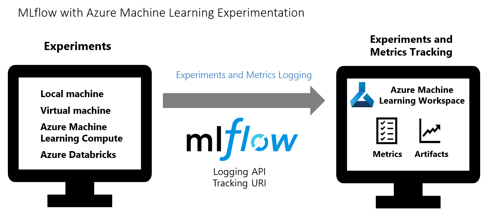
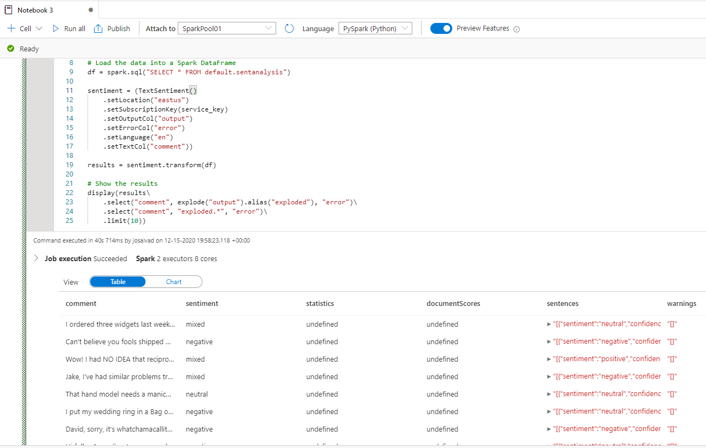

# Lab 7: Develop a Machine Learning Model and use Cognitive Services.
Develop a Machine Learning Model and use Cognitive Services.
In this lab you will use an Azure Machine Learning notebooks to develop a model that given a trip, predict whether there will be a tip or not. We will use the developed model to create predictions with a sql procedure. You will also use cognitive services in Synapse to perform sentiment analysis of customer reviews. 

The estimated time to complete this lab is: **45 minutes**.

## Microsoft Learn & Technical Documentation

The following Azure services will be used in this lab. If you need further training resources or access to technical documentation please find in the table below links to Microsoft Learn and to each service's Technical Documentation.

Azure Service | Microsoft Learn | Technical Documentation|
--------------|-----------------|------------------------|
Azure Machine Learning | [Train machine learning models Azure Machine Learning - Azure Synapse](https://docs.microsoft.com/en-us/azure/synapse-analytics/spark/apache-spark-machine-learning-training) | [Azure Machine Learning](https://docs.microsoft.com/en-us/azure/machine-learning/overview-what-is-azure-ml)
Azure Synapse Analytics | [Implement a Data Warehouse with Azure Synapse Analytics](https://docs.microsoft.com/en-us/learn/paths/implement-sql-data-warehouse/) | [Azure Synapse Analytics Technical Documentation](https://docs.microsoft.com/en-us/azure/sql-data-warehouse/)

## Lab Architecture


Step     | Description
-------- | -----
 | Develop a model using Azure Machine Learning MLFlow
 | Develop a model using apache-spark machine learning mllib
 | Use the developed model for new predictions.
 | Sentiment analysis with Cognitive Services in Azure Synapse

**IMPORTANT**: Some of the Azure services provisioned require globally unique name and a “-suffix” has been added to their names to ensure this uniqueness. Please take note of the suffix generated as you will need it for the following resources in this lab:

Name	                     |Type
-----------------------------|--------------------
amlworkspace*suffix*	         | Azure Machine Learning
asaworkspace*suffix*         | Azure Synapse Analytics workspace
syndtlake*suffix*	         |Storage Account


## Develop a model using Azure Machine Learning MLFlow


1. Let's start by downloading the notebook that will be used in this session. In the github page of the tutorial Lab7 click on the **notebookML.ipynb**.

    

2. Once the notebook is open, click on the **Raw**.

    

3. Click on **Ctrl + s** to save the file to your desktop, change the file extension to **ipynb**.

    


4. Open the lab resource group, locate and open the **amlworkspace{{suffix}}** Machine Learning resource. Click on **Launch studio**.

    


5. From the left menu of **Azure Machine Learning Studio**, select the **Notebooks** item and click **Upload files**.

    

6. Select the **notebookML.ipynb** that you have previously saved in your desktop and click on **Upload**.

    

7. Confirm that the notebook has been attached to the compute that you have created in Lab6.

8. Complete and review all the steps in the notebook, the notebook trains a model based on the DataStore that we have created before and convert the model to ONNX format and track it with MLFLlow and Azure Machine Learning Service. MLflow is an open-source library for managing the life cycle of your machine learning experiments. MLFlow Tracking is a component of MLflow that logs and tracks your training run metrics and model artifacts, no matter your experiment's environment--locally on your computer, on a remote compute target, a virtual machine, or an Azure Databricks cluste.
The following diagram illustrates that with MLflow Tracking, you track an experiment's run metrics and store model artifacts in your Azure Machine Learning workspace.

    

    

9. Azure Machine learning can be used to implement MLOps pipelines. MLOps empowers data scientists and app developers to help bring ML models to production. MLOps enables you to track / version / audit / certify / re-use every asset in your ML lifecycle and provides orchestration services to streamline managing this lifecycle.

    

10. After finising running the notebook observe the results in the experiments, go to the experiment blade and select the **Experiments**, navigate to the experiment created **nyc_taxi_tip_predict_exp**.

    

11. Select one of the Runs and observe the model in the **Outputs + logs**

    


## Develop a model using apache-spark machine learning mllib

In this section we will epxlore how to use Apache Spark MLlib to create a machine learning app that analyzes a dataset using classification through logistic regression.

Classification, a popular machine learning task, is the process of sorting input data into categories. It is the job of a classification algorithm to figure out how to assign labels to input data that you provide. For example, you can think of a machine learning algorithm that accepts stock information as input and divides the stock into two categories: stocks that you should sell and stocks that you should keep.
Logistic regression is an algorithm that you can use for classification. Spark's logistic regression API is useful for binary classification, or classifying input data into one of two groups. Let's develop around this. 

1. In the **Azure Synapse Analytics** portal click in the **Develop *(pages icon)*** option on the left-hand side panel. Click the  **+** and then click **Notebook** to create a new Notebook.

    


2. On the Notebook properties, enter the following details:
    <br>- **General > Name**: LAB 7 - Develop ML Spark Model

3. On the **Attach to** select the SparkPool01, the necesary libraries were already installed.

4. Import the types required for this application. Copy and paste the following code into an empty cell, and then press **SHIFT + ENTER**, or run the cell by using the blue play icon to the left of the code.

    ```python
    import matplotlib.pyplot as plt
    from datetime import datetime
    from dateutil import parser
    from pyspark.sql.functions import unix_timestamp, date_format, col, when
    from pyspark.ml import Pipeline
    from pyspark.ml import PipelineModel
    from pyspark.ml.feature import RFormula
    from pyspark.ml.feature import OneHotEncoder, StringIndexer, VectorIndexer
    from pyspark.ml.classification import LogisticRegression
    from pyspark.mllib.evaluation import BinaryClassificationMetrics
    from pyspark.ml.evaluation import BinaryClassificationEvaluator
    ```

### Construct the input dataframe

Because the raw data is in a Parquet format, you can use the Spark context to pull the file into memory as a dataframe directly. While the code below uses the default options, it is possible to force mapping of data types and other schema attributes if needed.

1. Run the following lines to create a Spark dataframe by pasting the code into a new cell. This retrieves the data from the Azure DataLake. We will filter the data for simplicity.

    ```python
    from datetime import datetime
    from dateutil import parser

    base_path ='abfss://nyctaxidata-curated@syndtlakekpq2soskyd5b4.dfs.core.windows.net/PickUpYearMonth='


    files = [base_path + '2019-01/*.parquet', 
            base_path + '2019-02/*.parquet',         
            base_path + '2019-03/*.parquet',
            base_path + '2019-04/*.parquet',
            base_path + '2019-05/*.parquet',
            base_path + '2019-06/*.parquet',
            ]
    df = spark.read.load(files, format='parquet')
    ```
2. The downside to simple filtering is that, from a statistical perspective, it may introduce bias into the data. An approach is to use the sampling built into Spark. The following code reduces the dataset down to about 10000 rows, if applied after the code bellow. 

    ```python
    # To make development easier, faster and less expensive down sample for now
    noOfSamples=10000
    sampled_taxi_df = df.sample(noOfSamples / df.count())
    ```

3. It is now possible to look at the data to see what was read. It is normally better to review data with a subset rather than the full set depending on the size of the dataset. The following code offers two ways to view the data: the former being basic and the latter providing a much richer grid experience, as well as the capability to visualize the data graphically.

    ```python
    #sampled_taxi_df.show(5)
    display(sampled_taxi_df)
    ```

4. Depending on the size of the dataset size generated, and your need to experiment or run the notebook many times, it may be advisable to cache the dataset locally in the workspace. There are three ways to perform explicit caching:

   - Save the dataframe locally as a file
   - Save the dataframe as a temporary table or view
   - Save the dataframe as a permanent table

The first 2 of these approaches are included in the following code examples.

Creating a temp table or view provides different access paths to the data, but only lasts for the duration of the Spark instance session.

```Python
sampled_taxi_df.createOrReplaceTempView("nytaxi")
```


### Prepare the data

The data in its raw form is frequently not suitable for passing directly to a model. A series of actions must be performed on the data to get it into a state where the model can consume it.
In the lab 3 we have already cleaned the data to make it easier for data scientists to use but we can confirm that everything is as expected and select only the columns that we are interested in.
In the code below four classes of operations are performed:

- The removal of outliers/incorrect values through filtering.
- The removal of columns, which are not needed.
- The creation of new columns derived from the raw data to make the model work more effectively, sometimes called featurization.
- Labeling - since you are undertaking binary classification (will there be a tip or not on a given trip) there is a need to convert the tip amount into a 0 or 1 value.

```python
taxi_featurised_df = sampled_taxi_df.select('TotalRideAmount', 'FareAmount', 'PaymentTypeID', 'PassengerCount', 'TripDistance'\
                                , date_format('PickUpDateTime', 'EEEE').alias('weekdayString')\
                                , (when(col('TipAmount') > 0, 1).otherwise(0)).alias('tipped')
                                )\
                        .filter((sampled_taxi_df.PassengerCount > 0) & (sampled_taxi_df.PassengerCount < 8)\
                                & (sampled_taxi_df.FareAmount >= 1) & (sampled_taxi_df.FareAmount <= 250)\
                                & (sampled_taxi_df.TripDistance > 0) & (sampled_taxi_df.TripDistance <= 100)\
                                & (sampled_taxi_df.PaymentTypeID.isin({"1", "2"}))
                                )
```

### Create a logistic regression model


The final task is to convert the labeled data into a format that can be analyzed by logistic regression. The input to a logistic regression algorithm needs to be a set of *label-feature vector pairs*, where the *feature vector* is a vector of numbers representing the input point. So, we need to convert the categorical columns into numbers. The `weekdayString` column needs to be converted into integer representations. There are multiple approaches to performing the conversion, however the approach taken in this example is *OneHotEncoding*, a common approach.

```python
# Since the sample uses an algorithm that only works with numeric features, convert them so they can be consumed
sI1 = StringIndexer(inputCol="weekdayString", outputCol="weekdayIndex")
en1 = OneHotEncoder(dropLast=False, inputCol="weekdayIndex", outputCol="weekdayVec")

# Create a new dataframe that has had the encodings applied
encoded_final_df = Pipeline(stages=[sI1, en1]).fit(taxi_featurised_df).transform(taxi_featurised_df)
```

This action results in a new dataframe with all columns in the right format to train a model.


### Train a logistic regression model

The first task is to split the dataset into a training set and a testing or validation set. The split here is arbitrary and you should play around with different split settings to see if they impact the model.

```python
#Decide on the split between training and testing data from the dataframe
trainingFraction = 0.7
testingFraction = (1-trainingFraction)
seed = 1234

# Split the dataframe into test and training dataframes
train_data_df, test_data_df = encoded_final_df.randomSplit([trainingFraction, testingFraction], seed=seed)
```

Now that there are two DataFrames, the next task is to create the model formula and run it against the training DataFrame, then validate against the testing DataFrame. You should experiment with different versions of the model formula to see the impact of different combinations.

```python
## Create a new LR object for the model
logReg = LogisticRegression(maxIter=10, regParam=0.3, labelCol = 'tipped')

## The formula for the model
classFormula = RFormula(formula="tipped ~ TotalRideAmount + weekdayVec + FareAmount + PaymentTypeID + PassengerCount + TripDistance ")

## Undertake training and create an LR model
lrModel = Pipeline(stages=[classFormula, logReg]).fit(train_data_df)

## Saving the model is optional but its another form of inter session cache
datestamp = datetime.now().strftime('%m-%d-%Y-%s')
fileName = "lrModel_" + datestamp
logRegDirfilename = fileName
lrModel.save(logRegDirfilename)

## Predict tip 1/0 (yes/no) on the test dataset, evaluation using AUROC
predictions = lrModel.transform(test_data_df)
predictionAndLabels = predictions.select("label","prediction").rdd
metrics = BinaryClassificationMetrics(predictionAndLabels)
print("Area under ROC = %s" % metrics.areaUnderROC)
```

The output from this cell is:

```shell
Area under ROC = 0.9783126787416587
```


## Use the Machine Learning Model to predict new data on SQL

In this section we will use the model created with sklearn to predict new data from the Taxi Data 2019 H2.

1. Go to **Data** -> **Workspace**. Open the SQL scoring wizard by right-clicking the dedicated SQL pool table. Select **Machine Learning** -> **Enrich with existing model**.

    

2. Select a linked Azure Machine Learning workspace in the drop-down box. This loads a list of machine learning models from the model registry of the chosen Azure Machine Learning workspace, select the one we have created in this lab **nyc_taxi_tip_predict** or the one created with AutoML if it is already available. Currently, only ONNX models are supported so this will display only ONNX models.

3. Select the model you trained then click Continue.

    

4. Next, map the table columns to the model inputs and specify the model outputs. If the model is saved in the MLFlow format and the model signature is populated, the mapping will be done automatically for you using a logic based on the similarity of names. The interface also supports manual mapping. Click **Continue**.

    

5. The generated T-SQL code is wrapped inside a Stored Procedure. This is why you need to provide a stored procedure a name. The model binary including metadata (version, description, etc.) will be physically copied from Azure Machine Learning to a dedicated SQL pool table. So you need to specify which table to save the model in. You can choose either to "Use an existing table" or to "Create a new table". Once done, click **Deploy model + open script** to deploy the model and generate a T-SQL prediction script. For stored procedure name select **[NYC].[predicfare]** and create a new table with name **[NYC].[Predictiontaxi]**. 

    

6. Once the script is generated, click "Run" to execute the scoring and get the predictions.

    
    


## Sentiment analysis with Cognitive Services in Azure Synapse

In this section, you will learn how to easily enrich your data in Azure Synapse with [Cognitive Services](https://go.microsoft.com/fwlink/?linkid=2147492). We will be using the [Text Analytics](https://docs.microsoft.com/azure/cognitive-services/text-analytics/) capabilities to perform sentiment analysis. A user in Azure Synapse can simply select a table containing a text column to enrich with sentiments. These sentiments can be positive, negative, mixed or neutral and a probability will also be returned.


### Create Secret Azure KeyVault


1. In the Azure Portal locate your Key Vault asakeyvault*suffix* 

1. Go to **Key Vault -> Access policies**, and grant the [Azure Synapse workspace MSI](https://docs.microsoft.com/azure/synapse-analytics/security/synapse-workspace-managed-identity) permissions to read secrets from Azure Key Vault. Give access to your asaworkspace*suffix*, if you can not add the secret add yourself on the access policies as well.

>Make sure that the policy changes are saved. This step is easy to miss.


3. Go to your Cognitive Service resource, **TextAnalysisSent*suffix* -> Keys and Endpoint**, copy either of the two keys to the clipboard.

4. Go to **Key Vault -> Secret** to create a new secret. Specify the name of the secret as **synapse**, and then paste the key from the previous step into the "Value" field. Finally, click **Create**.

    

> Make sure you remember or note down this secret name! You will use it later when you connect to Cognitive Services from Azure Synapse Studio.

### Create Azure Keyvault Linked Service in Azure Synapse

1. Open your workspace in Azure Synapse Studio. Navigate to **Manage -> Linked Services**. Create ab "Azure Key Vault" linked service pointing to the Key Vault we just created. Then, verify the connection by clicking "Test connection" button and checking if it is green. If anything works fine, click "Create" first and then click "Publish all" to save your change.

    


### Create a Spark table

1. Download the following CSV file containing a data set for text analytics: [FabrikamComments.csv](https://github.com/Kaiqb/KaiqbRepo0731190208/blob/master/CognitiveServices/TextAnalytics/FabrikamComments.csv).
Again you can click in the **Raw** and then **Ctrl + s** to save the file, remember to change the file extension to .csv

1. Upload the file to your Azure Synapse ADLSGen2 storage account syndtlake*suffix* in the container **defaultfs**.

    

1. Create a Spark table from the .csv file by right clicking on the file and selecting **New Notebook -> Create Spark table**.

    

1. Name the table **SentAnalysis** in the code cell and run the notebook on a Spark pool. Remember to set "header = True".

    

### Launch Cognitive Services wizard


1. Right-click on the Spark table created before. Select "Machine Learning-> Enrich with existing model" to open the wizard.

    

1. A configuration panel will appear and you will be asked to select a Cognitive Services model. Select Text analytics - Sentiment Analysis.

    

### Provide authentication details

In order to authenticate to Cognitive Services, you need to reference the secret to use in your Key Vault. 

- **Azure Subscription**: Select the Azure subscription that your key vault belongs to.
- **Cognitive Services Account**: This is the Text Analytics resource you are going to connect to.
- **Azure Key Vault Linked Service**: You have created a linked service to your Text Analytics resource. Please select it here.
- **Secret name**: This is the name of the secret in your key vault containing the key to authenticate to your Cognitive Services resource which is called **synapse**

    


### Configure Sentiment Analysis

Next, you need to configure the sentiment analysis. Please select the following details:
- **Language**: Select the language of the text you want to perform sentiment analysis on. Select **EN**.
- **Text column**: This is the text column in your dataset that you want to analyze to determine the sentiment. Select table column **comment**.

Once you are done, click **Open Notebook**. This will generate a notebook for you with PySpark code that performs the sentiment analysis with Azure Cognitive Services.


### Open notebook and run

The notebook you just opened is using the [mmlspark library](https://github.com/Azure/mmlspark) to connect to Cognitive services.

The Azure Key Vault details you provided allow you to securely reference your secrets from this experience without revealing them.

You can now **Run All** cells to enrich your data with sentiments. The sentiments will be returned as Positive/Negative/Neutral/Mixed, and you will also get probabilities per sentiment. Learn more about [Cognitive Services - Sentiment analysis](https://go.microsoft.com/fwlink/?linkid=2147792).


