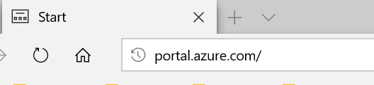
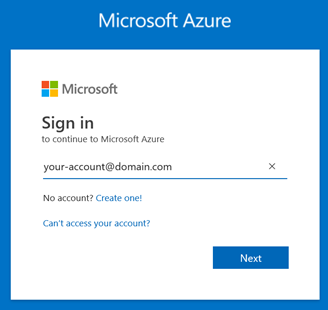
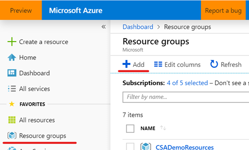
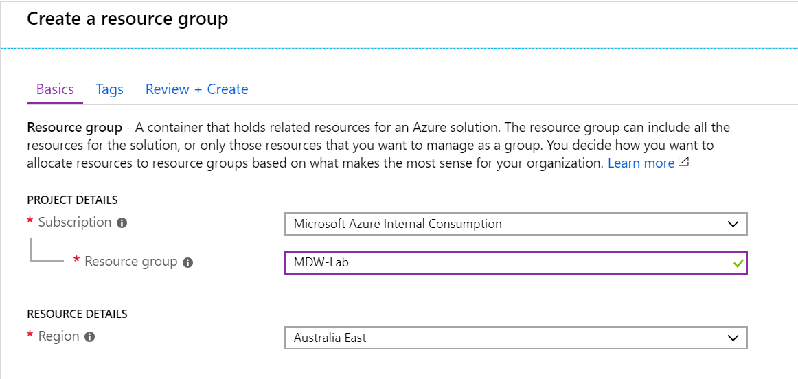
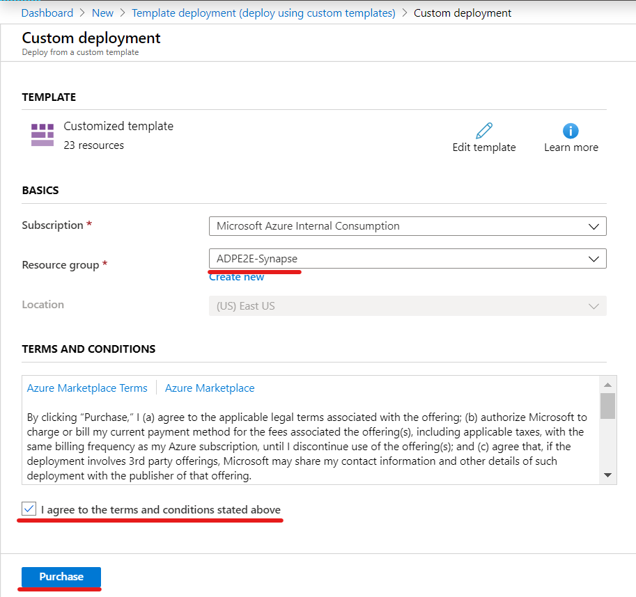
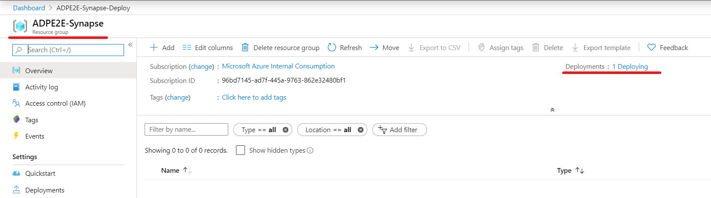
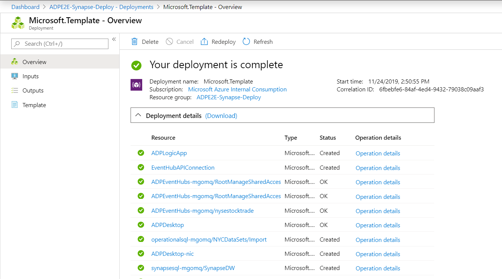

# Deploy Azure Data Platform End2End to your subscription

In this section you will automatically provision all Azure resources required to complete labs 1 though to 5. We will use a pre-defined ARM template with the definition of all Azure services used to ingest, store, process and visualise data. 

## Azure services provisioned for the workshop

The following Azure services will be deployed in your subscription:

Name                        | Type | Pricing Tier | Pricing Info |
----------------------------|------|--------------|--------------|
adpcosmosdb-*suffix*        | Azure Cosmos DB account | 400 RU/sec | https://azure.microsoft.com/en-us/pricing/details/cosmos-db/
ADPDatabricks-*suffix*      | Azure Databricks Service | Standard | https://azure.microsoft.com/en-us/pricing/details/databricks/
ADPComputerVision	        | Cognitive Services | S1 | https://azure.microsoft.com/en-us/pricing/details/cognitive-services/computer-vision/
ADPEventHubs-*suffix*       | Event Hubs Namespace | Standard | https://azure.microsoft.com/en-us/pricing/details/event-hubs/
ADPLogicApp	                | Logic app | | https://azure.microsoft.com/en-au/pricing/details/logic-apps/
asaworkspace*suffix*                   | Azure Synapse Analytics workspace |  | https://azure.microsoft.com/en-us/pricing/details/synapse-analytics/
operationalsql-*suffix*| SQL server || 
NYCDataSets                   | SQL database | Standard S1 | https://azure.microsoft.com/en-au/pricing/details/sql-database/single/
syndtlake*suffix*	        | Azure Data Lake Storage Gen2 || https://azure.microsoft.com/en-us/pricing/details/storage/data-lake/
SynapseStreamAnalytics-*suffix*	| Stream Analytics job | 3 SU | https://azure.microsoft.com/en-us/pricing/details/stream-analytics/
ADPIntegrationAccount       | Integration Account | Basic | https://azure.microsoft.com/en-au/pricing/details/logic-apps/
asakeyvault*suffix*       | Key Vault | Standard | https://azure.microsoft.com/en-us/pricing/details/key-vault/
amlworkspace*suffix*      | Azure Machine Learning| Enterprise | https://azure.microsoft.com/en-us/pricing/details/machine-learning/
asaappinsights*suffix*    | Application Insights | | https://azure.microsoft.com/en-us/pricing/details/monitor/
asastore*suffix*          |  Azure Data Lake Storage Gen2 || https://azure.microsoft.com/en-us/pricing/details/storage/data-lake/
SparkPool01               | Apache Spark pool | | https://azure.microsoft.com/en-us/pricing/details/synapse-analytics/
SynapseDW       | Dedicated SQL pool | DW100c | https://azure.microsoft.com/en-us/pricing/details/synapse-analytics/

## Prepare your Azure subscription
In this section you will use the Azure Portal to create a Resource Group that will host the Azure Data Services used in labs.

**IMPORTANT**|
-------------|
**Execute these steps on your host computer**|

1.	Open the browser and navigate to https://portal.azure.com

    

2.	Log on to Azure using your account credentials

    

3.	Once you have successfully logged on, locate the **Favourites** menu on the left-hand side panel and click the **Resource groups** item to open the **Resource groups** blade.

4.	On the **Resource groups** blade, click the **+ Add** button to create a new resource group.

    

5.	On the **Create a resource group** blade, select your subscription in **Subscription** drop down list.

6.	In the Resource group text box enter “MDW-Lab”

    

8.	In the Region drop down list, select one of the regions from the list below.

    **IMPORTANT**: The ARM template you will use to deploy the lab components uses the Resource Group region as the default region for all services. To avoid deployment errors when services are not available in the region selected, please use one of the recommended regions in the list below.

    Recommended Regions|
    -------------------|
    East US|
    South Central US|
    West US|
    Japan East|
    West Europe|
    UK South|
    Australia East|

9.	Proceed to create the resource group by clicking **Review + Create**, and then **Create**.

--------------------------------------
## Deploy Azure Services
In this section you will use automated deployment and ARM templates to automate the deployment of all Azure Data Services used in labs.

1. You can deploy all Azure services required in each lab by clicking the **Deploy to Azure** button below. 

2. You will be directed to the Azure portal to deploy the ARM template from this repository. On the **Custom deployment** blade, enter the following details:
     - **Subscription**: [your Azure subscription]
     - **Resource group**: [select the resource group you created in the previous section]

    Please review the Terms and Conditions and check the box to indicate that you agree with them.

3. Click **Purchase**

4. Navigate to your resource group to monitor the progress of your ARM template deployment. A successful deployment should last less than 10 minutes.

    

5. Once your deployment is complete you are ready to start your labs. Enjoy!

    

## Workshop cost management

The approximate cost to run the resources provisioned for the estimated duration of this workshop (2 days) is around USD 100.00. Remember that you will start get charged from the moment the resource template deployment completes successfully. You can minimise costs during the execution of the labs by taking the following actions below:

Azure Resource | Type | Action |
---------------|------|--------|
SynapseDW      | Azure Azure Synapse Analytics | Pause it while not using|
ADPDatabricks | Databricks Workspace | Stop cluster while not using
adpcosmosdb-*suffix*   | Cosmos DB | Delete ImageMetadata container after completing Lab 4
ADPLogicApp | Logic App | Disable it after completing Lab 5
SynapseStreamAnalytics-*suffix* | Stream Analytics job | Pause job after completing Lab 5

