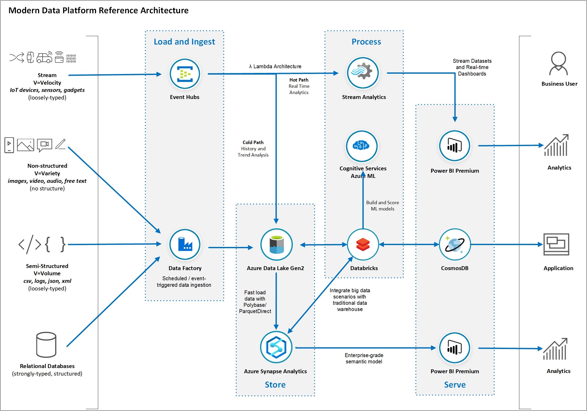
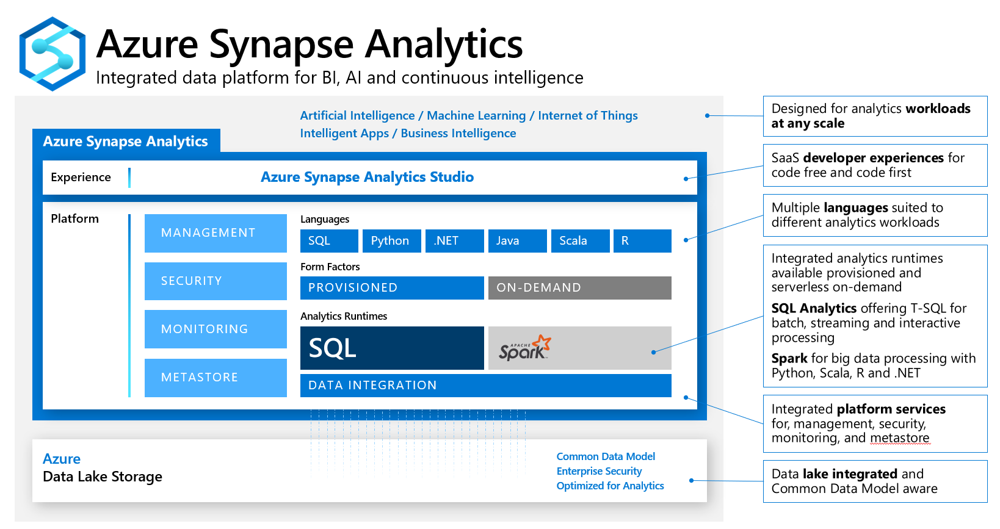
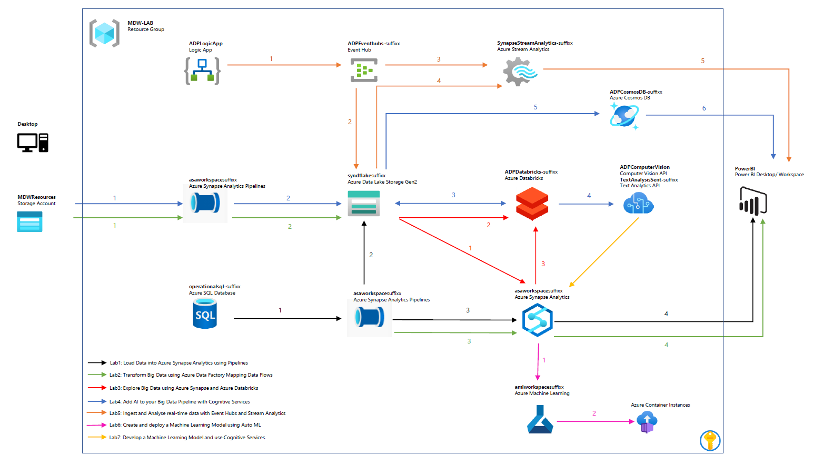
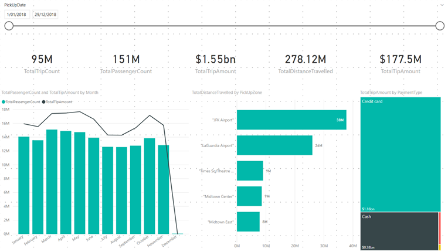
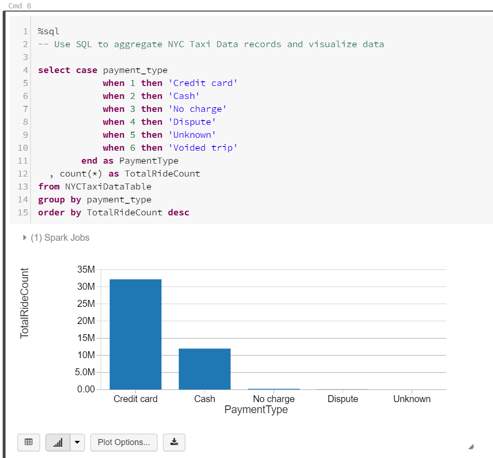
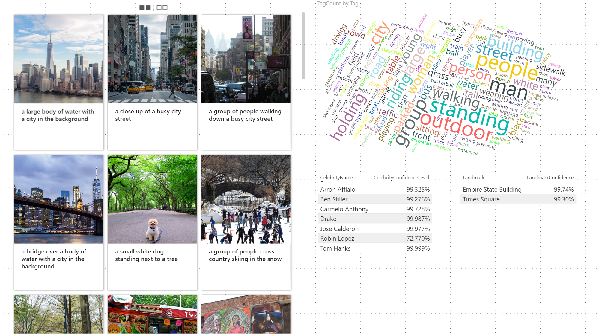
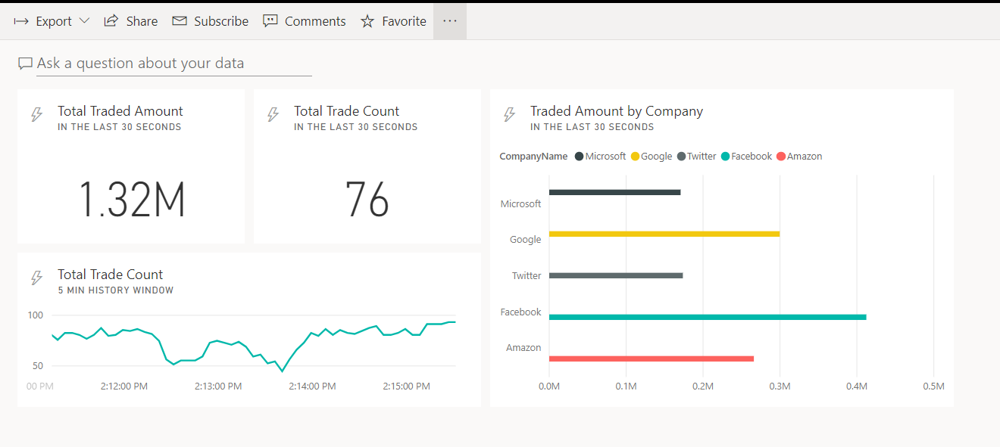
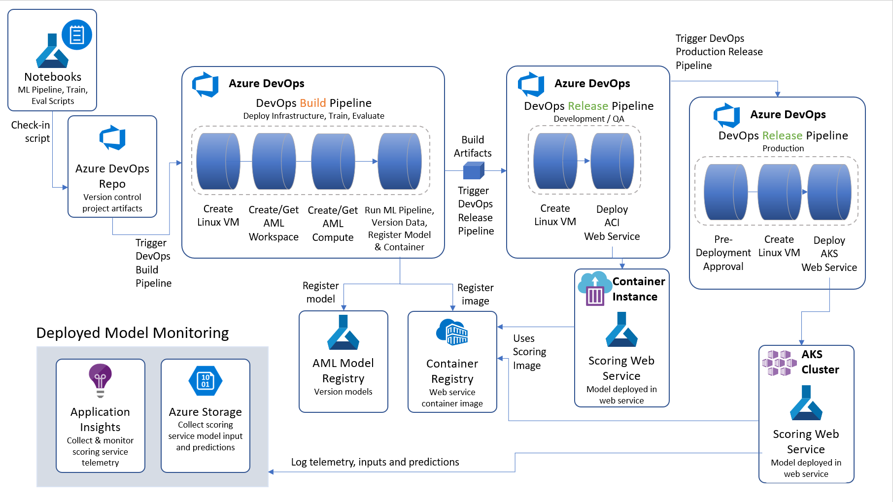

# Hands-on Azure Data & AI Platform End2End 

In this workshop you will learn about the main concepts related to advanced analytics and Big Data processing and how Azure Data Services can be used to implement a modern data warehouse architecture. You will learn what Azure services you can leverage to establish a solid data platform to quickly ingest, process and visualise data from a large variety of data sources. The reference architecture you will build as part of this exercise has been proven to give you the flexibility and scalability to grow and handle large volumes of data and keep an optimal level of performance.

In the exercises in this lab you will build data pipelines using data related to New York City. The workshop was designed to progressively implement an extended modern data platform architecture starting from a traditional relational data pipeline. Then we introduce big data scenarios with large data files and distributed computing. We add non-structured data and AI into the mix and we explore a case with real-time stream analytics we finish with use cases using Machine Learning. You will have done all of that by the end of the workshop.

**IMPORTANT**:

* The reference architecture proposed in this workshop aims to explain just enough of the role of each of the Azure Data Services included in the overall modern data platform architecture. This workshop does not replace the need of in-depth training on each Azure service covered.

* The services covered in this course are only a subset of a much larger family of Azure services. Similar outcomes can be achieved by leveraging other services and/or features not covered by this workshop. Specific business requirements may require the use of different services or features not included in this workshop.

* Some concepts presented in this course can be quite complex and you may need to seek more information from different sources to compliment your understanding of the Azure services covered.

In the figure bellow it is presented a Modern Data Platform reference architecture.

### Azure Synapse Analytics

Microsoft recently announced the General Availability of Azure Synapse Analytics. Azure Synapse Analytics can be seen as the evolution of Azure SQL Data Warehouse, blending big data, data warehousing, and data integration into a single service for end-to-end analytics at cloud scale. 
For more information please visit: https://azure.microsoft.com/en-au/services/synapse-analytics/

## Document Structure
This document contains detailed step-by-step instructions on how to implement a Modern Data Platform architecture using Azure Data Services. It’s recommended you carefully read the detailed description contained in this document for a successful experience with all Azure services. 

## Data Source References
New York City data used in this lab was obtained from the New York City Open Data website: https://opendata.cityofnewyork.us/. The following datasets were used:
     - NYPD Motor Vehicle Collisions: https://data.cityofnewyork.us/Public-Safety/NYPD-Motor-Vehicle-Collisions/h9gi-nx95
     - TLC Yellow Taxi Trip Data: https://www1.nyc.gov/site/tlc/about/tlc-trip-record-data.page

## Lab Prerequisites and Deployment
The following prerequisites must be completed before you start these labs:

* You must be connected to the internet;

* Use either Edge or Chrome when executing the labs. Internet Explorer may have issues when rendering the UI for specific Azure services.

* For some parts you will need to have a Power BI Pro account. If you don’t have an account you can sign up for a 60-day trial for free here: https://powerbi.microsoft.com/en-us/power-bi-pro/

* Install **Power BI Desktop (64-bit)**
     https://aka.ms/pbiSingleInstaller
     Select PBIDesktopSetup_x64.exe

* Complete the Prerequisites-Lab by completing the Lab 0 bellow.

### [Lab 0: Deploy Azure Data Platform End2End to your subscription](./Prerequisites-Lab/README.md)

In this section you will automatically provision all Azure resources required to complete the labs. We will use a pre-defined ARM template with the definition of all Azure services used to ingest, store, process and visualise data. 

The estimated time to complete this lab is: **30 minutes**.

**IMPORTANT**|
-------------|
**In order to avoid potential delays caused by issues found during the ARM template deployment it is recommended you execute Lab 0 prior to Day 1.**|

  
## Lab Guide

The labs are are composed by Labs focused first on a modern Data Warehouse and an End2End Data Platform and then focused on Machine Learning solutions.  

Throughout a series of labs you will progressively implement a modern data platform architecture using datasets from New York City. 

You will start ingesting relational data about motorvehicle collisions in Manhattan hosted in an Azure SQL Database into your Azure Synapse Analytics data warehouse. 

Then we will introduce the concepts of data lake and  big data challenges and you will put these into practice by ingesting and processing over 50 million yellow taxi ride records stored as large data files stored in your data lake.

You will then use Synapse and Databricks with their Spark clusters to explore big data files. Then you will incorporate AI into your data pipeline by invoking the Cognitive Services Computer Vision API to automatically generate metadata for New York City street photographs and store the metadata in a Cosmos DB database. 

Then you will use a LogicApp to simulate high-frequency stock purchase transactions as a source of streaming events that you will capture, store and process in real time with Event Hubs, Stream Analytics and Power BI.

You will then use Auto ML to create machine learning models and create your own models using sklearn and the ML Spark Lib. You will also leverage cognitive services to perform sentiment analysis.

By the end of the workshop you will have implemented the lab architecture referenced below:

### [Lab 1: Load Data into Azure Synapse Analytics using Pipelines](./Lab/Lab1/README.md)

In this lab you will configure the Azure environment to allow relational data to be transferred from an Azure SQL Database to an Azure Synapse Analytics database using Pipelines from Azure Synapse Analytics, this could also be performed by using Data Factory. The dataset you will use contains data about motor vehicle collisions that happened in New York City from 2012 to 2019. You will use Power BI to visualise collision data loaded from Azure Synapse Analytics.

The estimated time to complete this lab is: **30 minutes**.

Step     | Description
-------- | -----
 | Build an Azure Synapse Pipeline to copy data from an Azure SQL Database table
 | Use Azure Storage as a staging area for Polybase
 | Load data to an Azure Synapse Analytics table using Polybase
 | Visualize data from Azure Synapse Analytics using Power BI

### [Lab 2: Transform Big Data using Azure Data Factory Mapping Data Flows](./Lab/Lab2/README.md)
In this lab you will use Pipelines from Azure Synapse to download large data files into your data lake and use an Azure Synapse Analytics stored procedure to generate a summary dataset and store it in the final table. The dataset you will use contains detailed New York City Yellow Taxi rides for the first half of 2019. You will generate a daily aggregated summary of all rides using Mapping Data Flows and save the resulting dataset into your Azure Synapse Analytics data warehouse. You will then use Power BI to visualise summarised data. 

The estimated time to complete this lab is: **60 minutes**.

 
Step     | Description
-------- | -----
 | Build an Azure Synapse Pipeline to copy big data files from shared Azure Storage
 | Ingest data files into your data lake
 | Use Mapping Data Flows to generate a aggregated daily summary and save the resulting dataset into your Azure Synapse Analytics data warehouse.
 | Visualize data from your Azure Synapse Analytics using Power BI

### [Lab 3: Explore Big Data using Azure Synapse and Azure Databricks](./Lab/Lab3/README.md)
In this lab you will use Azure Synapse Spark Pools and SQL Serverless Pools to explore data, you will also use Azure Databricks to explore the New York Taxi data files that you have saved in your data lake in Lab 2. Using a Databricks notebook you will connect to the data lake and query taxi ride details. 

The estimated time to complete this lab is: **45 minutes**.

Step     | Description
-------- | -----
 |You will use  an Azure Synapse Spark Pools and SQL Serverless Pools to explore data.
 |Build an Azure Databricks notebook to explore the data files you saved in your data lake in the previous exercise. You will use Python and SQL commands to open a connection to your data lake and query data from data files. Finally you will integrate datasets from Azure Synapse Analytics data warehouse to your big data processing pipeline. Databricks becomes the bridge between your relational and non-relational data stores.

### [Lab 4: Add AI to your Big Data Pipeline with Cognitive Services](./Lab/Lab4/README.md)
In this lab you will use Azure Synapse Pipelines to download New York City images to your data lake. Then, as part of the same pipeline, you are going to use an Azure Databricks notebook to invoke Computer Vision Cognitive Service to generate metadata documents and save them back in your data lake. The Azure Synapse pipeline then finishes by saving all metadata information in a Cosmos DB collection. You will use Power BI to visualise NYC images and their AI-generated metadata.

The estimated time to complete this lab is: **60 minutes**.

Step     | Description
-------- | -----
 | Build an Synapse Pipeline to copy image files from shared Azure Storage
 | Save image files to your data lake
 | For each image in your data lake, invoke an Azure Databricks notebook that will take the image URL as parameter
 | For each image call the Azure Computer Vision Cognitive service to generate image metadata. Metadata files are saved back in your data lake
 | Copy metadata JSON documents into your Cosmos DB database
 | Visualize images and associated metadata using Power BI

### [Lab 5: Ingest and Analyse real-time data with Event Hubs and Stream Analytics](./Lab/Lab5/README.md)
In this lab you will use an Azure Logic App to simulate a NYSE stream of stock purchase transactions. The logic app will then send the messages to Event Hubs. You will then use Stream Analytics to receive and process the stream and perform aggregations to calculate the number of transactions and amount traded in the last 10 seconds. Stream Analytics will send the results to a real-time dataset in Power BI.

The estimated time to complete this lab is: **45 minutes**.

Step     | Description
-------- | -----
 | Review the Azure Logic App logic that simmulates the NYSE transaction stream sent to EventHubs
 | Save simulated NYSE stock transaction messages into your data lake for future analysis (cold path)
 | Send stream of NYSE stock transaction messages to Stream Analytics for real-time analytics (hot path)
 | Incorporate Stock Company reference data into your stream processing logic
 | Visualize real-time data generated by Stream Analytics with Power BI

### [Lab 6: Create and deploy a Machine Learning Model using Auto ML](./Lab/Lab6/README.md)
In this lab you will use Azure Machine Learning and Azure Synapse Analytics to create a model to predict tha taxi fare prices from the NYC Taxa Data. You will use Auto ML which is a feature that automatically trains a set of machine learning models and allows you to select the best model based on specific metrics. 

The estimated time to complete this lab is: **60 minutes**.

Step     | Description
-------- | -----
 | Configure a Linked Service to Azure Machine Learning in Synapse
 | Create an Auto ML Experiment in Azure Synapse
 | Create an Auto ML Experiment in Azure Machine Learning
 | Review the results in the Azure Machine Learning Studio

### [Lab 7: Develop a Machine Learning Model and use Cognitive Services](./Lab/Lab7/README.md)

Develop a Machine Learning Model and use Cognitive Services.
In this lab you will use an Azure Machine Learning notebooks to develop a model that given a trip, predict whether there will be a tip or not. You will also use cognitive services in Synapse to perform sentiment analysis of customer reviews. 

The estimated time to complete this lab is: **30 minutes**.

Step     | Description
-------- | -----
 | Develop a model using Azure Machine Learning MLFlow
 | Develop a model using apache-spark machine learning mllib
 | Use the developed model for new predictions.
 | Sentiment analysis with Cognitive Services in Azure Synapse

### [Lab 8: Deep Learning & MLOps end-to-end](./Lab/Lab8/)
In this hands-on lab, you will learn how Wide World Importers (WWI) can leverage Deep Learning technologies to scan through their vehicle specification documents to find compliance issues with new regulations. You will standardize the model format to ONNX and observe how this simplifies inference runtime code, enabling pluggability of different models and targeting a broad range of runtime environments, and most importantly, improves inferencing speed over the native model. You will build a DevOps pipeline to coordinate retrieving the latest best model from the model registry, packaging the web application, deploying the web application, and inferencing web service. After a first successful deployment, you will make updates to both the model, and the web application, and execute the pipeline once to achieve an updated deployment. You will also learn how to monitor the model's performance after it is deployed, so WWI can be proactive with performance issues.
At the end of this hands-on lab, you will be better able to implement end-to-end solutions that fully operationalize deep learning models, inclusive of all application components that depend on the model.

The estimated time to complete this lab is: **200 minutes**.

Step     | Description
-------- | -----
 | Creating and evaluating compliance Deep Learning classification models
 | Registering the model and Setup New Project in Azure DevOps
 | Setup and Run the Build Pipeline and Setup the Release Pipeline
 | Create Release for the Production Release Pipeline
 | Testing the deployed solution and review deployed model datasheet
 | Deploy the Production Deployment stage and examining deployed model performance

## Workshop Proposed Agenda

The workshop content will be delivered over the course of two days with the following agenda:

### **Day 1 - Morning**

Activity | Duration
-------- | ---------
Workshop Overview  | 30 minutes
**Modern Data Warehousing** |
Lab 1: Load Data into Azure Synapse Analytics using Azure Data Factory Pipelines    | 30 minutes
Lab 2: Transform Big Data using Azure Data Factory and Azure Synapse Analytics    | 60 minutes
**Advanced Analytics** |
Lab 3: Explore Big Data using Azure Databricks    | 45 minutes

### **Day 1 - Afternoon**

Activity | Duration
-------- | ---------
**AI & Machine Learning** |
Lab 4: Add AI to your Big Data Pipeline with Cognitive Services | 60 minutes
Lab 6: Create and deploy a Machine Learning Model using Auto ML    | 30 minutes
Lab 7:  Develop a Machine Learning Model and use Cognitive Services| 45 minutes

### **Extra Labs**

Activity | Duration
-------- | ---------
**Real-time Analytics** |
Lab 5: Ingest and Analyse real-time data with Event Hubs and Stream Analytics (Optional)   | 45 minutes
Lab 8: Deep Learning & MLOps end-to-end  | 200 minutes